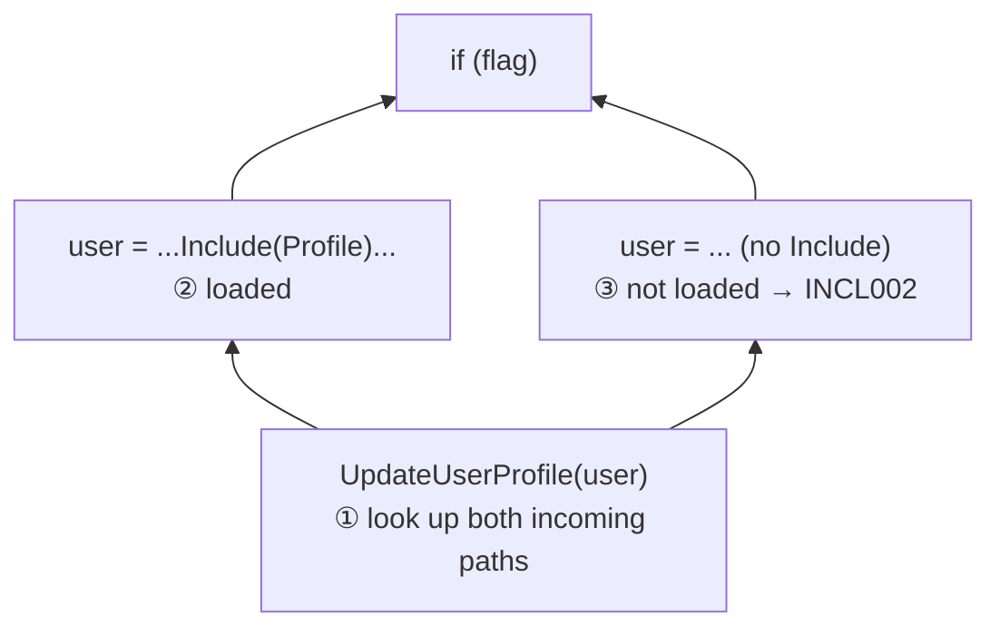
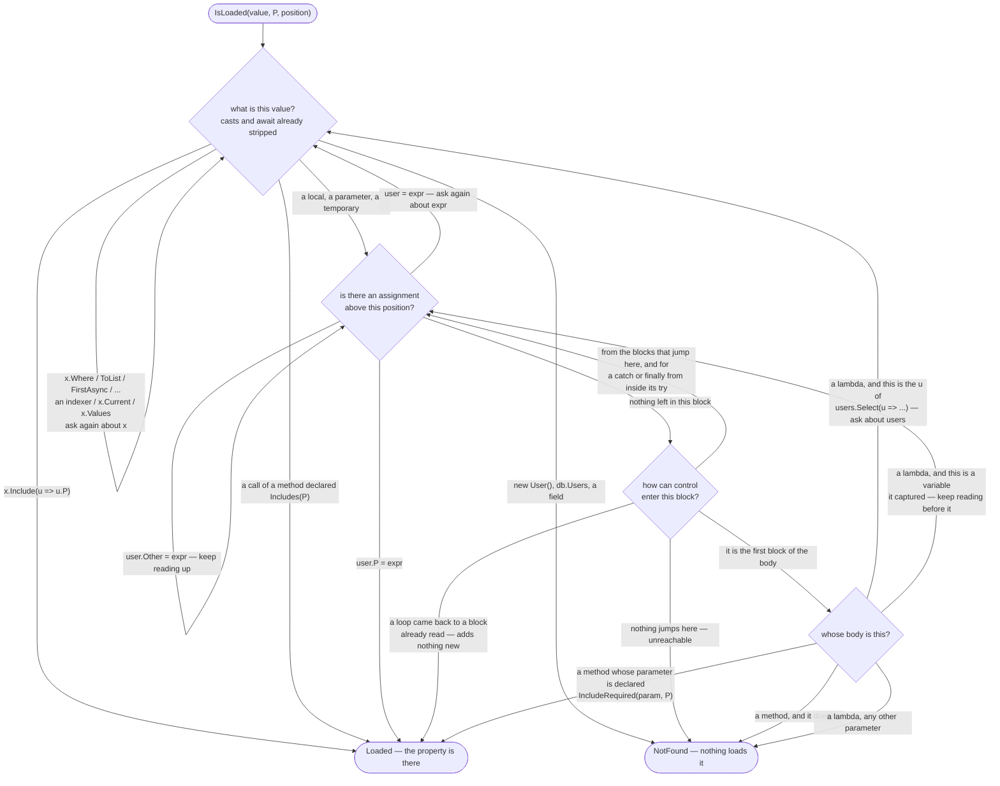

# NavigationInclude analyzer: how it works

For rule descriptions and attribute usage, see the [package README](../../README.md#navigation-include-attributes).

## The approach

The rules check values at two kinds of places:

| Place | Rule |
|---|---|
| a call of an `[IncludeRequired(param, Property)]` method | INCL001 if the argument is the method's own parameter, INCL002 if it is a local or a LINQ lambda parameter |
| a `return` of an `[Includes(Property)]` method | INCL003 (skipped with `Verify = false`) |

INCL001 for direct access (`user.Profile` inside a method) is simpler and handled by `PropertyReferenceHandler`.

At each place the analyzer asks one question: **is `Property` loaded in this value here?** It answers the
same way a person reads code. It **looks backward** from the place for where the variable got its value:

```csharp
var user = await db.Users.Include(u => u.Profile).FirstAsync();
user = await db.Users.FirstAsync();          // ② last assignment: no Include → not loaded
UpdateUserProfile(user, dto);                // ① start here, look up for "user = ..."
```

When several paths lead to the place, the property must be loaded on **every** path. The paths come from
Roslyn's **control flow graph**: the method split into blocks connected by jumps. Roslyn builds it, so `if`,
`switch`, `?:`, `??`, loops, `try` and `foreach` need no special code.



## The concepts

Four types carry the analysis, and the rest are lookups. They are easiest to learn against one example —
everything below refers to this code:

```csharp
[IncludeRequired(nameof(user), nameof(User.Profile))]   // "whoever calls me must load Profile"
void UpdateProfile(User user, string timezone)
    => user.Profile.Timezone = timezone;

async Task Handle(int id)
{
    var user = await db.Users.Include(u => u.Profile).FirstAsync(u => u.Id == id);
    UpdateProfile(user, "UTC");          // ← the analyzer checks this argument
}
```

### `FlowGraph` — one body being analyzed

A method, constructor, local function or lambda, together with the control flow graph Roslyn builds for it: the
body split into **blocks** connected by **jumps**. This is the unit the analyzer walks.

The body of a lambda that becomes a **delegate** is a graph of its own, and that is the one awkward part: the
statement that creates the lambda holds nothing but a reference to that body. `CreationStatement` is the bridge
back. It is set for a lambda and `null` for every other kind of body, and it is how a variable captured by
a lambda is followed out into the method around it:

```csharp
var users = await db.Users.Include(u => u.Profile).ToListAsync();
var timezones = users.Select(u => GetTimezone(u, dto)).ToList();
//                          └─ its own FlowGraph; CreationStatement is this "var timezones = …" line,
//                             which is how "u" is followed back to "users"
```

The example at the top has only one graph, `Handle`. Its `u => u.Profile` and `u => u.Id == id` go to
`IQueryable` as **expression trees**, which are data rather than code, so Roslyn does not give them graphs —
`Include` is read straight from the lambda's syntax instead.

### `CodePosition` — a point in execution

Graph + block + how many statements of the block have already run.

| Member | Meaning |
|---|---|
| `Statement` | the statement that runs next — `null` at the end of a block, where nothing runs next |
| `GetPreviousStatements()` | the statements that already ran, nearest first |

One position answers both "which statement is this?" and "what was assigned before it?" — exactly the pair a
backward search alternates between. In the example, the call's position is *one statement into the block that
holds the body of `Handle`*: its `Statement` is `UpdateProfile(user, "UTC")` and `GetPreviousStatements()`
yields the `var user = ...` line.

### `Origin` — where the entities of a value come from

A value plus the position it is read at. The search never asks "is the property loaded?" of a value directly.
It asks "where did this come from?" and repeats. Two origins are answers rather than places in the code:

| Origin | Meaning |
|---|---|
| `Origin.Loaded` | the property is loaded here — stop |
| `Origin.NotFound` | the entities come from somewhere the search cannot follow — count as not loaded |

`Origin.Create` strips casts, delegate wrappers and `await` off the value, so no rule below has to deal with
them. The example traces like this, each step being one "where did it come from?":

```text
Origin( user , before "UpdateProfile(user, …)" )
      a variable → look up for its last assignment → "var user = await …"
Origin( db.Users.Include(u => u.Profile).FirstAsync(…) , before "var user = …" )
      the await was stripped when the origin was created
      FirstAsync keeps its source's entities → the value it is called on
Origin( db.Users.Include(u => u.Profile) , before "var user = …" )
      Include names Profile
Origin.Loaded                                    → nothing reported
```

Change the first line to `var user = await db.Users.FirstAsync(...)` and the last two steps become
`Origin( db.Users , … )` → `NotFound`, which is INCL002.

### `VariableOrigin` — where a variable's value comes from

The walking half. A variable gets its value from the last assignment before the place it is read, which may be
in another block, in another body, or on several paths at once — so this is the half that moves the position,
and the only one that needs memory (the blocks it has already read, which is what makes loops terminate).

Reading one statement, it answers with an `Origin`, or with `null` meaning "this statement says nothing, keep
reading upward":

| Statement | Origin it gives the variable |
|---|---|
| `user = expr`, `var user = expr` | `expr`, read at this statement |
| `user.Profile = expr` | `Origin.Loaded` |
| `user.Other = expr` | *none* — keep reading upward |
| `var (id, user) = pair` | `pair` |
| `d.TryGetValue(key, out var user)` | `d` |
| `Compute(out var user)` | `Origin.NotFound` — nothing is known about an arbitrary `out` |
| does not touch the variable | *none* — keep reading upward |

`GetRelatedVariable` is the other half: it maps an operation back to the variable it reads. A "variable" here is
a local, a parameter or a compiler temporary (`#1`) — see **What the compiler rewrites for us** below.

### `ExpressionOrigin` — where an expression's entities come from

The other half of the same question. `x.Include(u => u.P)` answers `Loaded`; `x.Where(...)` / `x.ToList()` /
an indexer / `x.Current` answer with the `x` they were called on; anything else answers `NotFound`. These rules
need nothing but the expression, which is why they sit outside the search — and they never move the position.

Reading a variable is an expression too, of course. It is the one case that lives in `VariableOrigin` instead,
because it is the only one that cannot be answered on the spot.

### `LoadedPropertySearch` — the rule

The only thing that decides, and now barely 60 lines: one public method
`IsLoaded(value, property, position) → true / false`, the three-line rule, and a dispatch that sends an origin
to whichever of the two halves above can answer it. See **How it works** below.

### `LinqMethods`, `AttributeHelper`, `RoslynHelper` — lookups, not concepts

Facts the rule consults: which LINQ/EF methods keep their source's entities (`Where`, `ToList`, `FirstAsync`,
…), which pass elements to a lambda (`Select`, `Any`, …), what `Include(u => u.Profile)` names, what a method's
attributes ask for, and which Roslyn wrappers to ignore. Nothing to model — just tables.

### `IncludeFlowHandler`, `PropertyReferenceHandler` — where the rule is applied

The search answers a question; something has to ask it. `IncludeFlowHandler` walks every statement of a body,
finds the two places worth checking, and reports what comes back. `PropertyReferenceHandler` covers the simpler
INCL001 case — `user.Profile` read directly inside a method — which needs no flow analysis at all.

## How it works

There is one black box: **`LoadedPropertySearch.IsLoaded(value, property, position)` → true / false.** Its only
changing state is the set of blocks already searched.

`IncludeFlowHandler` maps statements to diagnostics and reports them at the end:

```text
statements = new FlowGraph(body).GetStatements()   // also lambdas and local functions
diagnostics = for each statement:
    calls of an [IncludeRequired(param, P)] method where not IsLoaded(argument for param, P) → INCL001 / INCL002
    "return value" of an [Includes(P)] method where not IsLoaded(value, P)                   → INCL003
report diagnostics
```

Inside the black box everything is one idea: an **origin** — a value plus the place it is read at. The search
traces an origin back to the origins its entities come from, and there are two origins that are answers in
themselves, `Loaded` and `NotFound`. So the whole search is three lines:

```text
IsLoaded(origin):
    origin is Loaded    → true
    origin is NotFound  → false
    otherwise           → every origin it comes from must be loaded
```

Everything else is "where does this come from", asked over and over. There are only four questions, and every
answer either asks one of them again or ends the search:



Two rules the arrows cannot carry. When a step produces **several** origins — the ways into a block — **every
one** of them must end at `Loaded`. And an arrow back into a question means "ask that same question about the
new value", which is why the search terminates only at the two rounded boxes.

So there are exactly **five ways to find the loader**:

| Ending at `Loaded` | Example |
|---|---|
| an `.Include()` for the property | `db.Users.Include(u => u.Profile)` |
| a method that promises it | `[Includes("Profile")] Task<User> GetUser()` |
| the property set by hand | `user.Profile = profile;` or `new User { Profile = p }` |
| a parameter the method demands loaded | `[IncludeRequired(nameof(user), "Profile")] void Update(User user)` |
| a loop returning to a block already read | `while (…) { … }` — that path adds nothing new |

and five ways to fail:

| Ending at `NotFound` | Example |
|---|---|
| a value the search cannot follow | `new User()`, `db.Users`, a field, an arbitrary call |
| a method parameter without the attribute | → INCL001, which asks you to add `[IncludeRequired]` |
| a lambda parameter that is not a LINQ element | `Select((u, i) => …)`, a lambda of a non-LINQ method |
| an `out` argument of an arbitrary method | `Compute(out var user)` — but `d.TryGetValue(k, out var user)` follows `d` |
| unreachable code | no block jumps there |

### One origin, step by step

The linear case is in **The concepts** above. This is the interesting one — a branch, where the search fans out
and the answers disagree:

```csharp
1   var query = db.Users.AsQueryable();
2   if (withProfile)
3   {
4       query = query.Include(u => u.Profile);
5   }
6
7   var user = await query.FirstAsync();
8   UpdateProfile(user, "UTC");        // [IncludeRequired(nameof(user), "Profile")]
```

```text
① Origin( user , before line 8 )
     a variable → read the block upward → line 7 assigns it

② Origin( query.FirstAsync() , before line 7 )     the await was stripped when the origin was created
     FirstAsync keeps its source's entities

③ Origin( query , before line 7 )
     a variable again → nothing above line 7 in this block
     → two ways into the block, and BOTH must end at Loaded:

     ├─ way A — from the end of the if body
     │  ④ Origin( query.Include(u => u.Profile) , before line 4 )
     │       Include names Profile
     │  ⑤ Origin.Loaded                                                          ✓
     │
     └─ way B — from the end of the block before the if
        ⑥ Origin( db.Users.AsQueryable() , before line 1 )
             AsQueryable keeps its source's entities
        ⑦ Origin( db.Users , before line 1 )
             a DbSet property — no rule follows it
        ⑧ Origin.NotFound                                                        ✗

every way must be Loaded → false → INCL002 on line 8
```

Watch which half of the origin moves:

- **②→③ and ⑥→⑦ change only the value.** The search stays on the same statement and peels one call off.
  That is `ExpressionOrigin` — it never moves the position.
- **①→②, ③→④ and ③→⑥ change the position too.** That is the search walking to another statement, another
  block, or out of a lambda — and it only ever happens through a *variable*.

So the position is the slow hand of the clock: it ticks once per variable, while the value spins through the
call chain of a single expression. That split is exactly why `ExpressionOrigin` and `VariableOrigin` are
separate files, and why only the variable half needs the search's memory of blocks already read.

A few value rules are finer than the diagram shows: `x.ToDictionary(u => u.Id)` keeps the entities but
`x.ToDictionary(u => u.Id, u => u.Name)` does not, and `pair.Value` and `x.GetValueOrDefault(key)` pass through
to `x`. `LinqMethods` holds the full list.

A rule never answers with *nothing*: a dead end is `NotFound`, so "not loaded" always means one thing — the
search traced the entities to a place it cannot follow. That is what lets the origins of all the ways into
a block be thrown into one list: `NotFound` keeps a way that leads nowhere from disappearing out of the "all of
them" check.

The "block already searched" rule is what makes loops work. The search goes around the loop once, sees every
assignment in the loop body, and stops.

The graph has no jumps for exceptions: the first block of a `catch`, `catch when` filter or `finally` has no
incoming jumps, so it looks unreachable. An exception can leave the `try` block after any statement, which is
why *every place* inside it counts as a way into the handler (for `finally` after `try/catch`, the `catch`
blocks are included too). This is the only reason `GetWaysIntoBlock` is more than `block.Predecessors`.

## Files

See **The concepts** above for what each one is for.

| File | Responsibility |
|---|---|
| `NavigationIncludeAnalyzer.cs` | Registers the two handlers with Roslyn. |
| `Handlers/IncludeFlowHandler.cs` | Finds the places to check, asks `IsLoaded`, reports INCL001 / INCL002 / INCL003. |
| `Handlers/PropertyReferenceHandler.cs` | INCL001 for direct `param.Profile` access — no flow analysis. |
| `Flow/LoadedPropertySearch.cs` | The black box `IsLoaded`: the three-line rule, and which half answers an origin. |
| `Flow/Origin.cs` | A value plus the position it is read at, or one of the answers `Loaded` / `NotFound`. |
| `Flow/CodePosition.cs` | A point in execution: graph + block + statements already run. |
| `Flow/FlowGraph.cs` | One body and its control flow graph. Lists its statements, lambdas and local functions included. |
| `Flow/VariableOrigin.cs` | Where a variable's value comes from: the backward walk through statements, blocks and bodies, and what a variable is. |
| `Flow/ExpressionOrigin.cs` | The origin of an expression: `Include`, LINQ calls, indexers, `Current`. |
| `Flow/LinqMethods.cs` | Facts about LINQ/EF methods: which keep entities, which pass elements to lambdas, `Include` parsing. |
| `Flow/RoslynHelper.cs` | Strips the conversion and delegate wrappers Roslyn puts around values. |
| `Services/AttributeHelper.cs` | Reads `[IncludeRequired]`, `[Includes]` and `[TrackIncludeRequired]` off symbols. |
| `Services/NavigationIncludeRulesProvider.cs` | The diagnostic descriptors and their ids. |
| `Entities/IncludeRequirement.cs` | One `[IncludeRequired(parameter, property)]` pair. |

## What the compiler rewrites for us

The graph contains simplified code. Two constructs look different from the source:

| Source | In the graph | Why it works |
|---|---|---|
| `new User { Profile = p }` | `#1 = new User(); #1.Profile = p; user = #1` | backward search for `#1` finds `#1.Profile = p` |
| `foreach (var user in users)` | `#1 = users.GetEnumerator(); ... user = #1.Current` | `Current` and `GetEnumerator` pass through to `users` |
| `flag ? a : b`, `a ?? b` | two blocks assign `#1`, then they merge | both paths are searched |

`#1` is a temporary variable the compiler creates (`IFlowCaptureOperation`). The search treats it like any other
variable.
