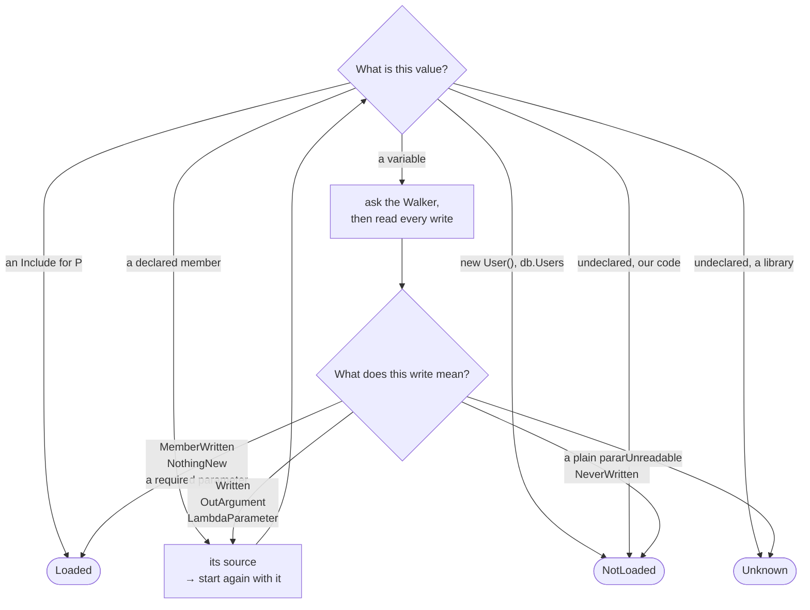
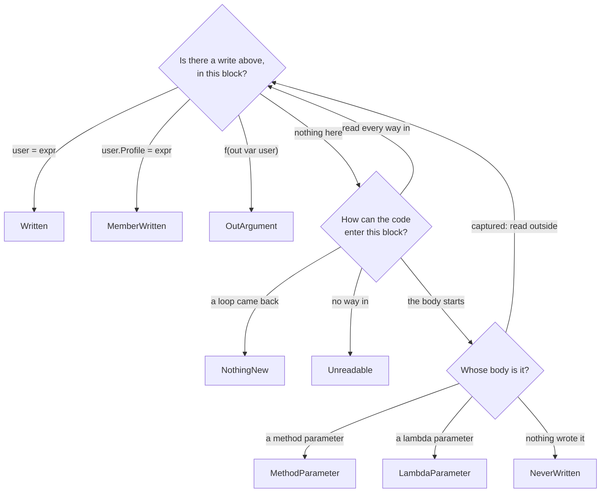

# NavigationInclude analyzer: how it works

This document explains how the NavigationInclude analyzer is built. It is for developers who want to understand
or change it. You do not need to know Roslyn: the few compiler words it uses are explained where they appear.

If you only want to *use* the analyzer, read the [package README](../../README.md#navigation-include-attributes).

## Contents

1. [Why this analyzer exists](#why-this-analyzer-exists)
2. [What the analyzer checks](#what-the-analyzer-checks)
3. [How it works: one idea, two jobs](#how-it-works-one-idea-two-jobs)
4. [Two examples, step by step](#two-examples-step-by-step)
5. [What the analyzer knows about entities](#what-the-analyzer-knows-about-entities)
6. [Reading the code: bodies and positions](#reading-the-code-bodies-and-positions)
7. [Special cases](#special-cases)
8. [When the analyzer cannot read the code](#when-the-analyzer-cannot-read-the-code)
9. [Files](#files)

## Why this analyzer exists

In Entity Framework Core, a *navigation property* (for example `user.Profile`) is **not loaded by default**.
It is filled only if the query asks for it with `Include`:

```csharp
var user = await db.Users.FirstAsync(u => u.Id == id);                               // Profile is null
var user = await db.Users.Include(u => u.Profile).FirstAsync(u => u.Id == id);       // Profile is loaded
```

If the code reads `user.Profile.Timezone` and `Include` was forgotten, the program fails at run time with a
`NullReferenceException`. The compiler does not warn about it. This is hard to find, because:

- the query and the code that uses `user.Profile` are often in different methods, or even different classes;
- the code works in tests if the test data happens to have a profile, or if the entity is already in the EF cache;
- somebody can remove an `Include` later and nothing shows that another method needed it.

The analyzer moves this check from run time to compile time. A developer writes the requirement **in the method
that needs the property**, and the analyzer checks **every place that calls the method**:

```csharp
[IncludeRequired(nameof(user), nameof(User.Profile))]   // "who calls me must load Profile"
void UpdateProfile(User user, string timezone)
    => user.Profile.Timezone = timezone;

async Task Handle(int id)
{
    var user = await db.Users.Include(u => u.Profile).FirstAsync(u => u.Id == id);
    UpdateProfile(user, "UTC");          // OK: Profile is loaded
}

async Task HandleBroken(int id)
{
    var user = await db.Users.FirstAsync(u => u.Id == id);
    UpdateProfile(user, "UTC");          // warning: Profile is not loaded
}
```

This is the example used in the rest of this document.

## What the analyzer checks

Two kinds of places, and both ask the same thing about one value:

| Place | What is checked | Rule |
|---|---|---|
| a call of a method with `[IncludeRequired(param, Property)]` | the argument for `param` must have `Property` loaded | INCL001 if the argument is a parameter of the current method, INCL002 if it is a local variable or a lambda parameter |
| a `return` in a method with `[Includes(Property)]` | the returned value must have `Property` loaded | INCL003 (not checked if `Verify = false`) |

Reading `user.Profile` directly inside a method is also INCL001. That case needs no search at all and is handled
by `PropertyReferenceHandler` alone. The rest of this document is about the other two.

Two more results come out of the search itself. **INCL004** means *the analyzer could not read the code far
enough to decide*; it is a warning with a code fix, see
[When the analyzer cannot read the code](#when-the-analyzer-cannot-read-the-code). **INCL005** is about the
declarations themselves: an `[assembly: PreservesIncludes]` that names a member which does not exist.

## How it works: one idea, two jobs

### The idea

At each checked place the analyzer asks:

> **Is the property loaded in this value, at this point of the code?**

A value does not say by itself whether its property is loaded, so the analyzer does what a person does when
reading code: it goes **backward**, to the place where the value was made.

```csharp
var user = await db.Users.Include(u => u.Profile).FirstAsync();
user = await db.Users.FirstAsync();          // ② the last write has no Include → not loaded
UpdateUserProfile(user, dto);                // ① start here, look up for "user = ..."
```

Sometimes several paths lead to the same place, for example after an `if`. Then the property must be loaded on
**every** path. The paths come from Roslyn's *control flow graph* — its picture of a method as blocks of
statements connected by arrows — so the analyzer needs no special code for `if`, `switch`, `?:`, `??`, loops,
`try` or `foreach`.

### The four words the code is built from

| Word | Meaning | File |
|---|---|---|
| **Value** | a place where entities sit: a variable, a parameter, an argument or the result of an expression, together with the position in the code where it is read | `Flow/Value.cs` |
| **Answer** | what the search decided: `Loaded`, `NotLoaded` or `Unknown` | `Flow/Answer.cs` |
| **Write** | one thing found above a variable: `Written`, `MemberWritten`, `OutArgument`, `MethodParameter`, `LambdaParameter`, `NothingNew`, `NeverWritten`, `Unreadable` | `Flow/Write.cs` |
| **Transformation** | a move from one value to another that keeps the same entities: `Where`, `ToList`, `page.Items`, an indexer | `Flow/Transformation.cs` |

A value is a question and an answer is a decision, and the code never mixes the two. A write is a fact about the
code and never a decision.

### The two jobs

The search itself is one function, `IncludeSearch.Check(value, property, position)`, and two classes share the
work behind it:

| Class | Its question | What it knows | What it never does |
|---|---|---|---|
| `IncludeSearch` | does this value have the include? | `Include`, declarations, the three answers | read blocks or statements |
| `Walker` | where was this variable written? | statements, blocks, `if`, loops, `try`, lambdas | decide anything |

The Walker reports writes, `IncludeSearch` says what they mean, and only `IncludeSearch` calls the Walker,
never the other way round. Only the Walker needs memory: it remembers the blocks it has already read, which is
what stops a loop from walking forever.

The whole search is these two jobs calling each other back:

```text
Check(value):
    IncludeSearch reads the value
        it was made from another value  → start again with that one
        it is a variable                → ask the Walker where it was written
                                          the Walker reports one write per path
                                          IncludeSearch reads each write, and gets
                                          an answer or a new value to start again with
        anything else                   → an answer

    every path must end at Loaded
```

### What IncludeSearch does

It has two questions: what a value is, and what a write of the Walker means. Both end at an answer, or at a
new value to start again with. The tables under the diagrams say which code each label stands for.



### How the Walker finds the writes

It only reads code. Every arrow that ends in a box is a write it reports, and `IncludeSearch` is the one that
says what the write means. "Read every way in" means every block that jumps here, and for a `catch` or a
`finally` every place inside the `try` as well.



Two rules are in neither diagram:

1. When a step gives **several** values (the two ways into a block after an `if`, or two sources of one call),
   **every one** of them must end at `Loaded`. The first one that does not gives the answer.
2. A dead end is never "nothing". It is always `NotLoaded` or `Unknown`, so a path that leads nowhere cannot
   silently disappear from the check.

### Where each path ends

| Ending | Answer | Example |
|---|---|---|
| an `Include()` for the property | `Loaded` | `db.Users.Include(u => u.Profile)` |
| a method that promises it | `Loaded` | `[Includes("Profile")] Task<User> GetUser()` |
| the property is set by hand | `Loaded` | `user.Profile = profile;` or `new User { Profile = p }` |
| a parameter the method requires loaded | `Loaded` | `[IncludeRequired(nameof(user), "Profile")] void Update(User user)` |
| a loop that came back to a block already read | `Loaded` | `while (…) { … }` — this path adds nothing new |
| a value the search can read to its start | `NotLoaded` | `new User()`, `db.Users`, a method of this project that promises nothing |
| a method parameter without the attribute | `NotLoaded` | reported as INCL001, which asks for `[IncludeRequired]` |
| unreachable code | `Unknown` | no block jumps there |
| a call nobody declared, in another assembly | `Unknown` | `query.Paginate(1)` from a library |
| a lambda parameter that is not a LINQ element | `Unknown` | `Select((u, i) => …)`, a lambda given to a method that is not LINQ |
| an `out` argument of a method nobody declared | `Unknown` | `Compute(out var user)`, while `d.TryGetValue(k, out var user)` follows `d`, because `TryGetValue` is declared |

`NotLoaded` is a mistake in the user's code and `Unknown` is a limit of the analyzer. They must not be mixed,
because a wrong warning is worse than no warning.

### What the Walker reports

For one statement it returns a write, or nothing, which means "this statement says nothing, keep reading
upward":

| Statement | Write | What `IncludeSearch` makes of it |
|---|---|---|
| `user = expr`, `var user = expr` | `Written(expr)` | read `expr` |
| `user.Profile = expr` | `MemberWritten` | `Loaded` |
| `user.Other = expr` | none | keep reading upward |
| `var (id, user) = pair` | `Written(pair)` | read `pair` |
| `d.TryGetValue(key, out var user)` | `OutArgument(the call)` | read the call's source, if it is declared |
| does not touch the variable | none | keep reading upward |

At the start of a body it reports `MethodParameter` or `LambdaParameter` instead, and around a loop
`NothingNew`. A "variable" here is a local, a parameter or a temporary the compiler made (`#1`), see
[Special cases](#special-cases).

## Two examples, step by step

### Example 1: a straight line

```csharp
var user = await db.Users.Include(u => u.Profile).FirstAsync(u => u.Id == id);
UpdateProfile(user, "UTC");          // ← the analyzer checks this argument
```

```text
Value( user , before "UpdateProfile(user, …)" )
      a variable → the Walker reports the write "var user = await …"
Value( db.Users.Include(u => u.Profile).FirstAsync(…) , before "var user = …" )
      "await" is removed when the value is created
      FirstAsync is declared: it hands back the entities it was called on → look at the source
Value( db.Users.Include(u => u.Profile) , before "var user = …" )
      Include names Profile
Answer.Loaded                                    → nothing is reported
```

Without the `Include`, the last two steps become `Value( db.Users , … )` → `NotLoaded`, and the analyzer reports
INCL002.

### Example 2: a branch

Here the search must check two paths, and they give different answers:

```csharp
1   var query = db.Users.AsQueryable();
2   if (withProfile)
3   {
4       query = query.Include(u => u.Profile);
5   }
6
7   var user = await query.FirstAsync();
8   UpdateProfile(user, "UTC");        // [IncludeRequired(nameof(user), "Profile")]
```

```text
① Value( user , before line 8 )
     a variable → the Walker reads the block upward → line 7 writes it

② Value( query.FirstAsync() , before line 7 )     "await" is removed
     FirstAsync hands back the same entities → look at the source

③ Value( query , before line 7 )
     a variable again → nothing above line 7 in this block
     → the Walker reports one write per way into the block, and BOTH must end at Loaded:

     ├─ way A — from the end of the "if" body
     │  ④ Value( query.Include(u => u.Profile) , before line 4 )
     │  ⑤ Answer.Loaded                                                          ✓
     │
     └─ way B — from the block before the "if"
        ⑥ Value( db.Users.AsQueryable() , before line 1 )
             AsQueryable hands back the same entities → look at the source
        ⑦ Value( db.Users , before line 1 )
             a DbSet property — no declaration describes it
        ⑧ Answer.NotLoaded                                                       ✗

Every way must be Loaded → the answer is not Loaded → INCL002 on line 8
```

A value has two parts, and the two jobs change them differently:

- **②→③ and ⑥→⑦ change only the value.** The position stays the same, because one call is removed from the
  chain. This is `IncludeSearch` reading an expression.
- **①→②, ③→④ and ③→⑥ also change the position.** The search moves to another statement, another block or out of
  a lambda. This happens only for a variable, and it is the `Walker`.

### Example 3: a value made of many steps

One value can be a whole chain. Here every kind of step appears once:

```csharp
1   var page = await db.Users.Include(u => u.Profile).Paginate(1);
2   foreach (var user in page.Items)
3   {
4       UpdateProfile(user, "UTC");     // [IncludeRequired(nameof(user), "Profile")]
5   }
```

`Paginate` is a library method, declared once for the solution, and `Items` is its property:

```csharp
[assembly: PreservesIncludes(typeof(SomeLib.QueryExtensions), "Paginate", "query")]
[assembly: PreservesIncludes(typeof(SomeLib.PagedResult<>), "Items")]
```

```text
① Value( user , before line 4 )
     a variable → the Walker finds what "foreach" became: "user = #1.Current"

② Value( #1.Current , inside the loop )
     Current is declared on IEnumerator<T> → look at the object it is read on

③ Value( #1 , inside the loop )
     a temporary, still a variable → the Walker finds "#1 = page.Items.GetEnumerator()"

④ Value( page.Items.GetEnumerator() , before the loop )
     GetEnumerator is declared on IEnumerable<T> → look at the source

⑤ Value( page.Items , before the loop )
     Items is declared on PagedResult<T> → look at the object it is read on

⑥ Value( page , before the loop )
     a variable again → line 1 writes it

⑦ Value( db.Users.Include(u => u.Profile).Paginate(1) , before line 1 )
     "await" is removed; Paginate is declared with the parameter "query"
     → look at the argument passed for that parameter, not at the result

⑧ Value( db.Users.Include(u => u.Profile) , before line 1 )
⑨ Answer.Loaded                                                              ✓
```

Steps ②, ④, ⑤ and ⑦ are transformations, ①, ③ and ⑥ are the Walker, and nothing in this chain needed a rule of
its own: `foreach`, the enumerator, the indexer-like property and the library method are all declarations.

If the `Items` declaration were missing, step ⑤ would end at `Unknown` and the analyzer would report INCL004 on
line 4, with a code fix that writes that declaration.

## What the analyzer knows about entities

### `IncludeDeclarations`: the only place that decides what is followed

A method or a property is followed **only if it is declared** with `[PreservesIncludes]`. There is no guessing
from types and no special code for `System.Linq` or EF Core. A declaration comes from one of three places, and
all of them are used the same way:

| Where | Example |
|---|---|
| on the member itself | `[PreservesIncludes(nameof(query))] PagedResult<User> Paginate(IQueryable<User> query)` |
| on an assembly: the project or anything it references | `[assembly: PreservesIncludes(typeof(SomeLib.Ext), "Paginate")]` |
| built into the analyzer | `Where`, `ToListAsync`, `Include`, `GetEnumerator`, `Current`, `TryGetValue`, indexers, … |

The built-in list is in `IncludeDeclarations.cs`. It names types by string, so the analyzer does not depend on
EF Core, and a line for a type the project does not use simply matches nothing. A declaration on an interface
covers every class that implements it, so `IEnumerable<T>.GetEnumerator` covers the `GetEnumerator` that
`foreach` calls on a `List`, and `IList<T>` covers the indexer of `List<T>`.

`Select` and `SelectMany` are **not** declared. They make new objects, so their result has no includes.

### `Transformation`: may the entities move, and where from?

Every step that is not an `Include` and not a variable asks this one question, and the answer is the value on
the other side of the move. The shape of the move does not matter:

| Move | Example |
|---|---|
| collection to collection | `query.Where(...)`, `users.ToList()` |
| collection to one value | `users.First()`, `users[0]`, `enumerator.Current` |
| one value to collection | `page.Items` |
| one value to another | `pair.Value`, `task.Result` |

All four are the same thing to the search: the entities on both sides are the same ones, so it keeps walking.
The move is permitted by a declaration, with one exception — an array element, `users[0]` over `User[]`, has no
member in Roslyn for a declaration to name, and there is only one value it can come from.

One question is left that a declaration cannot answer.

**Is this overload the right one?** A declaration names a method, not one overload, so each call is checked
against the method's own declaration: if the result is built from type parameters, one of them must come from
the source.

| Call | Declared result | Followed? |
|---|---|---|
| `users.ToDictionary(u => u.Id)` | `Dictionary<TKey, TSource>` | yes, `TSource` comes from `users` |
| `users.ToDictionary(u => u.Id, u => u.Name)` | `Dictionary<TKey, TElement>` | no, the values are names |
| `query.Paginate(1)` | `PagedResult<User>` | yes, nothing to compare, so the declaration is trusted |

This also protects against a wrong declaration: even if someone declares `Select`, its result is built from
`TResult`, so it is never followed.

This is read from how the member itself is declared, so it works the same for `System.Linq`, EF Core and a
project's own methods.

### `LambdaSource`: where a lambda parameter is filled from

In `users.Select(u => ...)` the question is whether `u` is filled from `users`. This is a different question:
a declaration says where a *result* comes from, while this is about what goes *in*, so no declaration can
answer it. The analyzer reads the delegate the lambda is passed to, one parameter at a time, and asks whether
that parameter's declared type is one of the types inside the collection.

| Lambda | Parameter | Declared as | Filled from the collection? |
|---|---|---|---|
| `Select(u => …)` | `u` | `TSource` | yes |
| `Select((u, i) => …)` | `i` | `int` | no |
| `GroupBy(k, (manager, group) => …)` | `manager` | `TKey` | no |
| `GroupBy(k, (manager, group) => …)` | `group` | `IEnumerable<TSource>` | yes |
| `ForEachItem(this IEnumerable<T>, Action<T>)` | `item` | `T` | yes |

Nothing here depends on the position of the parameter, so a project's own method reads the same way as a LINQ
operator.

### `EfIncludes`: the only code that knows Entity Framework

Every other rule answers "do the entities pass through this call?", which a declaration can say. This one
answers a different question, "which property was added?", and no general rule can do that:

```csharp
query.Include(u => u.Profile)   // the analyzer must read the name "Profile" from the lambda
```

It stays a transformation as well: `Include(u => u.Orders)` does not load `Profile`, and the search keeps
walking back through it.

## Reading the code: bodies and positions

`FlowGraph` is one body being analyzed — a method, constructor, local function or lambda — with its control
flow graph from Roslyn. `IncludeFlowHandler` walks its statements, finds the places to check and reports the
results.

A lambda that becomes a delegate is the difficult case. It has a graph of its own, and the statement that
creates it holds only a reference. `FlowGraph.CreationStatement` is the way back, so a variable captured by a
lambda can be followed out into the method around it:

```csharp
var users = await db.Users.Include(u => u.Profile).ToListAsync();
var timezones = users.Select(u => GetTimezone(u, dto)).ToList();
//                          └─ this lambda has its own FlowGraph. Its CreationStatement is the line
//                             "var timezones = …", and from there "u" is followed back to "users".
```

Lambdas such as `u => u.Profile` inside `Include(...)` are different: they are passed to `IQueryable` as
expression trees, which are data and not code, so Roslyn gives them no graph. `Include` is read from the syntax
of the lambda instead.

`CodePosition` is a point in execution: a graph, a block, and the number of statements of that block that have
already run. One position answers both questions a backward search needs — `Statement` is the statement that
runs next, and `GetPreviousStatements()` gives the ones that already ran, the nearest first.

## Special cases

### What the compiler rewrites

The control flow graph holds simplified code. Three constructs look different from the source:

| Source | In the graph | Why the search still works |
|---|---|---|
| `new User { Profile = p }` | `#1 = new User(); #1.Profile = p; user = #1` | walking back for `#1` finds `#1.Profile = p` |
| `foreach (var user in users)` | `#1 = users.GetEnumerator(); … user = #1.Current` | `GetEnumerator` and `Current` are declared, so they pass through to `users`. Over an array the old non-generic `IEnumerator` is used, and it is declared too. |
| `flag ? a : b`, `a ?? b` | two blocks write `#1`, then they join | both paths are searched |

`#1` is a temporary variable the compiler creates. The Walker treats it as any other variable.

### Loops

A loop goes back to a block that was already read. The Walker remembers the blocks it has read; when it comes
back to one it reports `NothingNew`, and the search counts that path as `Loaded` because it adds nothing. So
the search goes around a loop once, reads every write in the loop body, and stops.

### Exceptions

The graph has no jumps for exceptions. The first block of a `catch`, a `catch when` filter or a `finally` has no
incoming jumps, so it looks unreachable. But an exception can leave the `try` block after any statement, so
**every place inside the `try`** counts as a way into the handler. For a `finally` after `try/catch`, the
`catch` blocks are included too. This is the only reason the Walker does more than `block.Predecessors`.

## When the analyzer cannot read the code

The analyzer follows only declared members. `System.Linq`, EF Core and the collection types are declared in the
analyzer, so they work with no setup. Anything else has to be declared by the project:

```csharp
var page = query.Paginate(1);   // a library method: nobody declared it
var user = page.Items[0];       // a library property: nobody declared it
```

For a library, the analyzer reports **INCL004**: it cannot read the code. For a method in the project's own
code it reports **INCL002** instead, because that method can be read and it promises nothing. In both cases the
fix is `[PreservesIncludes]`, which means "this member returns the entities that it was given":

```csharp
[PreservesIncludes(nameof(query))]                      // on a method: names the parameter
public PagedResult<User> Paginate(IQueryable<User> query, int page)

[PreservesIncludes]                                     // on a property: the object it belongs to
public List<T> Items { get; set; }
```

For a library the project does not own, the attribute goes on the assembly, before the namespace:

```csharp
[assembly: PreservesIncludes(typeof(SomeLib.QueryExtensions), "Paginate", "query")]
[assembly: PreservesIncludes(typeof(SomeLib.PagedResult<>), "Items")]
```

Assembly attributes are read from the project itself and from every project and package it references, so a
shared project can declare a library once for the whole solution. If such a declaration names a member or a
parameter that does not exist, for example after the library renamed a method, the analyzer reports **INCL005**;
without it the declaration would silently stop working.

Users do not have to write these by hand. The code fix for INCL004 offers them and creates the file
`NavigationIncludes.cs` if the project has none yet, the way Visual Studio uses `GlobalSuppressions.cs`.

The attribute does not say *which* property is loaded. It only says **where the entities come from**, and the
search continues from there.

## Files

| File | What it does |
|---|---|
| `NavigationIncludeAnalyzer.cs` | Registers the three handlers in Roslyn. |
| `Handlers/IncludeFlowHandler.cs` | Finds the places to check, calls `Check`, reports INCL001 – INCL004. |
| `Handlers/DeclarationHandler.cs` | INCL005: an `[assembly: PreservesIncludes]` that names nothing. |
| `Handlers/PropertyReferenceHandler.cs` | INCL001 for direct `param.Profile` access, without flow analysis. |
| `Flow/IncludeSearch.cs` | The only class that decides. `Check`: reads a value, asks the Walker, joins the paths. |
| `Flow/Value.cs` | What the search looks at: an expression and the position it is read at. |
| `Flow/Answer.cs` | What the search decided: `Loaded` / `NotLoaded` / `Unknown`. |
| `Flow/Walker.cs` | Where a variable was written: the backward walk through statements, blocks and bodies. |
| `Flow/Write.cs` | One thing the Walker found. A fact about the code, never a decision. |
| `Flow/Transformation.cs` | May the entities move out of this value, and which value did they come from. The only file that reads declarations. |
| `Flow/LambdaSource.cs` | Which collection a lambda parameter is filled from. |
| `Flow/CodePosition.cs` | A point in execution: graph + block + number of statements already run. |
| `Flow/FlowGraph.cs` | One body and its control flow graph. Lists its statements, lambdas and local functions included. |
| `Flow/EfIncludes.cs` | The only rule that knows EF: reads the property name from `Include(u => u.Profile)`. |
| `Flow/RoslynHelper.cs` | Roslyn details with no meaning of their own: wrappers, the receiver of a call, the types inside a type, a delegate parameter. |
| `Services/IncludeDeclarations.cs` | All `[PreservesIncludes]` the compilation can see, the built-in ones included. The only place that decides what is followed. |
| `Services/UnreadableMember.cs` | The member that stopped the search. INCL004 carries it for the code fix. |
| `Services/AttributeHelper.cs` | Reads `[IncludeRequired]`, `[Includes]` and `[TrackIncludeRequired]` from symbols. |
| `Services/NavigationIncludeRulesProvider.cs` | The diagnostic descriptors and their ids. |
| `CodeFixes/PreservesIncludesCodeFixProvider.cs` | The code fix for INCL004: writes a `[PreservesIncludes]` declaration. |
| `Entities/IncludeRequirement.cs` | One `[IncludeRequired(parameter, property)]` pair. |
