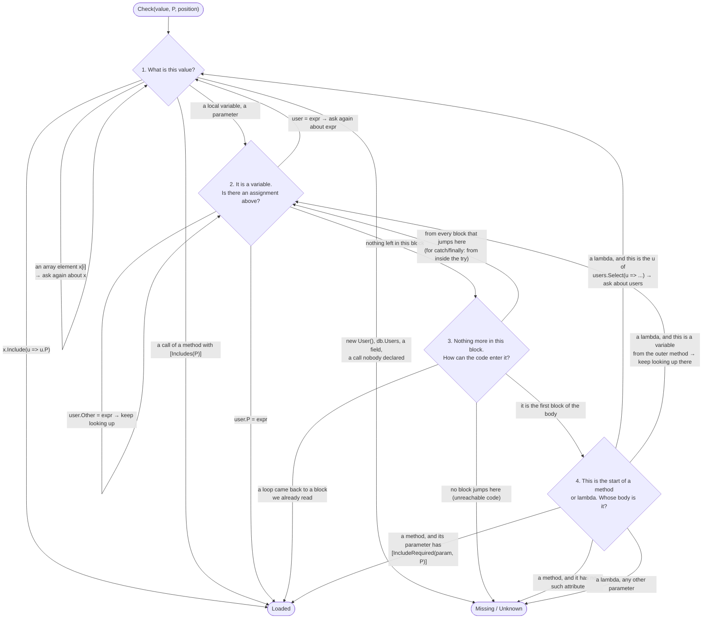

# NavigationInclude analyzer: how it works

This document explains how the NavigationInclude analyzer is built. It is for developers who want to understand
or change the analyzer. You do not need to know Roslyn. The terms you need are explained in
[Terms](#terms).

If you only want to *use* the analyzer, read the [package README](../../README.md#navigation-include-attributes).

## Contents

1. [Why this analyzer exists](#why-this-analyzer-exists)
2. [What the analyzer does](#what-the-analyzer-does)
3. [Terms](#terms)
4. [The main idea: read the code backward](#the-main-idea-read-the-code-backward)
5. [How the search works](#how-the-search-works)
6. [Two examples, step by step](#two-examples-step-by-step)
7. [The parts of the code](#the-parts-of-the-code)
8. [Special cases](#special-cases)
9. [When the analyzer cannot read the code](#when-the-analyzer-cannot-read-the-code)
10. [Files](#files)

## Why this analyzer exists

In Entity Framework Core, a *navigation property* (for example `user.Profile`) is **not loaded by default**.
It is filled only if the query asks for it with `Include`:

```csharp
var user = await db.Users.FirstAsync(u => u.Id == id);                               // Profile is null
var user = await db.Users.Include(u => u.Profile).FirstAsync(u => u.Id == id);       // Profile is loaded
```

If the code reads `user.Profile.Timezone` and `Include` was forgotten, the program fails at run time with a
`NullReferenceException`. The compiler does not warn about it. This is hard to find, because:

- the query and the code that uses `user.Profile` are often in different methods, or even different classes;
- the code works in tests if the test data happens to have a profile, or if the entity is already in the EF cache;
- somebody can remove an `Include` later and nothing shows that another method needed it.

The analyzer moves this check from run time to compile time. A developer writes the requirement **in the method
that needs the property**, and the analyzer checks **every place that calls the method**:

```csharp
[IncludeRequired(nameof(user), nameof(User.Profile))]   // "who calls me must load Profile"
void UpdateProfile(User user, string timezone)
    => user.Profile.Timezone = timezone;

async Task Handle(int id)
{
    var user = await db.Users.Include(u => u.Profile).FirstAsync(u => u.Id == id);
    UpdateProfile(user, "UTC");          // OK: Profile is loaded
}

async Task HandleBroken(int id)
{
    var user = await db.Users.FirstAsync(u => u.Id == id);
    UpdateProfile(user, "UTC");          // warning: Profile is not loaded
}
```

This is the example used in the rest of this document.

## What the analyzer does

The analyzer checks a value in two kinds of places:

| Place | What is checked | Rule |
|---|---|---|
| a call of a method with `[IncludeRequired(param, Property)]` | the argument for `param` must have `Property` loaded | INCL001 if the argument is a parameter of the current method, INCL002 if it is a local variable or a lambda parameter |
| a `return` in a method with `[Includes(Property)]` | the returned value must have `Property` loaded | INCL003 (not checked if `Verify = false`) |

Reading `user.Profile` directly inside a method is also INCL001. This case is simple and is handled only by
`PropertyReferenceHandler`, without any flow analysis. The rest of this document is about the other cases.

There is one more result, **INCL004**. It means: *the analyzer could not read the code far enough to decide.*
It is a warning too, because an unchecked value can hide a real mistake, but it comes with a code fix. See
[When the analyzer cannot read the code](#when-the-analyzer-cannot-read-the-code).

**INCL005** is about the declarations themselves: an `[assembly: PreservesIncludes]` that names a member which
does not exist.

## Terms

| Term | Meaning |
|---|---|
| **Entity** | An object that represents a database row, for example `User`. |
| **Navigation property** | A property of an entity that points to related data, for example `user.Profile`. |
| **Loaded** | The navigation property is filled with data, so it is safe to use. |
| **Roslyn** | The C# compiler as a library. An analyzer is a plugin that runs inside the compiler and receives the code as objects, not as text. |
| **Operation** | The Roslyn object for one piece of code: a call, an assignment, a variable, and so on. |
| **Block** | A group of statements that always run one after another, with no branch inside. |
| **Control flow graph** | Roslyn's picture of one method: blocks connected by arrows. An arrow means "this block can run after that one". An `if` gives a block with two arrows going out. |

## The main idea: read the code backward

At each checked place, the analyzer asks one question:

> **Is the property loaded in this value, at this point of the code?**

A value does not say by itself whether its property is loaded. To find out, the analyzer does what a person
does when reading the code: it goes **backward** and looks for the place where the value was created.

```csharp
var user = await db.Users.Include(u => u.Profile).FirstAsync();
user = await db.Users.FirstAsync();          // ② the LAST assignment has no Include → not loaded
UpdateUserProfile(user, dto);                // ① start here, look up for "user = ..."
```

Sometimes several paths lead to the same place, for example after an `if`. Then the property must be loaded
on **every** path. Roslyn's control flow graph gives these paths, so the analyzer needs no special code for
`if`, `switch`, `?:`, `??`, loops, `try` or `foreach`.


## How the search works

### One function answers the question

The search is one function: `LoadedPropertySearch.Check(value, property, position)`. It returns one of three
answers:

| Answer | Meaning | Result for the user |
|---|---|---|
| `Loaded` | The property is loaded. | nothing |
| `Missing` | The analyzer followed the value to its start and the property is not there. | warning (INCL001 / 002 / 003) |
| `Unknown` | The analyzer reached code it cannot read, so it cannot tell. | warning with a code fix (INCL004) |

`Missing` is a mistake in the user's code. `Unknown` is a limit of the analyzer. They must not be mixed, because
a wrong warning is worse than no warning.

`IncludeFlowHandler` is the code that calls `Check`. In pseudo-code:

```text
for each statement in the method (lambdas and local functions included):
    if it calls a method with [IncludeRequired(param, P)]:
        answer = Check(argument for param, P)
    if it returns from a method with [Includes(P)]:
        answer = Check(returned value, P)

    answer is Missing  → report INCL001 / INCL002 / INCL003
    answer is Unknown  → report INCL004
```

### A step of the search: `Origin`

Inside `Check`, everything is built from one small idea. An **origin** is:

> a value **plus** the position in the code where this value is read.

The search does not ask "is the property loaded?" about the value directly. It asks a simpler question again
and again: **"where do the entities in this value come from?"** Each answer is a new origin, closer to the
start. The search repeats until it reaches a place where the answer is known:

```text
Check(origin):
    if the origin is Loaded, Missing or Unknown → that is the answer
    otherwise → find the origins it comes from and check each of them;
                every one must be Loaded, and the first one that is not gives the answer
```

`Loaded`, `Missing` and `Unknown` are also origins. They are the three places where the search stops.

### The four questions

"Where does this come from?" has only four forms. Each answer either ends the search or asks one of the four
questions again about a new value:



Two rules are not visible in the diagram:

1. When a step gives **several** origins (for example, the two ways into a block after an `if`), **every one**
   of them must end at `Loaded`.
2. A dead end is never "nothing". It is always `Missing` or `Unknown`. This is why "all of them must be
   loaded" works: a path that leads nowhere cannot silently disappear from the check.

### Five ways to end at `Loaded`

| Ending | Example |
|---|---|
| an `Include()` for the property | `db.Users.Include(u => u.Profile)` |
| a method that promises it | `[Includes("Profile")] Task<User> GetUser()` |
| the property is set by hand | `user.Profile = profile;` or `new User { Profile = p }` |
| a parameter that the method requires loaded | `[IncludeRequired(nameof(user), "Profile")] void Update(User user)` |
| a loop that returned to a block already read | `while (…) { … }` — this path adds nothing new |

### Five ways to end at `Missing` or `Unknown`

| Ending | Example |
|---|---|
| a value the search cannot follow | `new User()`, `db.Users`, a field, an unknown method call |
| a method parameter without the attribute | reported as INCL001 and asks the user to add `[IncludeRequired]` |
| a lambda parameter that is not a LINQ element | `Select((u, i) => …)`, a lambda passed to a method that is not LINQ |
| an `out` argument of an unknown method | `Compute(out var user)` (but `d.TryGetValue(k, out var user)` follows `d`) |
| unreachable code | no block jumps there |

## Two examples, step by step

### Example 1: a straight line

The example from the beginning of this document:

```csharp
var user = await db.Users.Include(u => u.Profile).FirstAsync(u => u.Id == id);
UpdateProfile(user, "UTC");          // ← the analyzer checks this argument
```

Each step is one "where does this come from?":

```text
Origin( user , before "UpdateProfile(user, …)" )
      user is a variable → look up for its last assignment → "var user = await …"
Origin( db.Users.Include(u => u.Profile).FirstAsync(…) , before "var user = …" )
      "await" is removed when the origin is created
      FirstAsync returns the same entities that it was called on → look at the source
Origin( db.Users.Include(u => u.Profile) , before "var user = …" )
      Include names Profile
Origin.Loaded                                    → nothing is reported
```

If the first line is `var user = await db.Users.FirstAsync(...)`, the last two steps become
`Origin( db.Users , … )` → `Missing`, and the analyzer reports INCL002.

### Example 2: a branch

Here the search must check two paths, and they give different answers:

```csharp
1   var query = db.Users.AsQueryable();
2   if (withProfile)
3   {
4       query = query.Include(u => u.Profile);
5   }
6
7   var user = await query.FirstAsync();
8   UpdateProfile(user, "UTC");        // [IncludeRequired(nameof(user), "Profile")]
```

```text
① Origin( user , before line 8 )
     a variable → read the block upward → line 7 assigns it

② Origin( query.FirstAsync() , before line 7 )     "await" is removed
     FirstAsync returns the same entities → look at the source

③ Origin( query , before line 7 )
     a variable again → nothing above line 7 in this block
     → there are two ways into the block, and BOTH must end at Loaded:

     ├─ way A — from the end of the "if" body
     │  ④ Origin( query.Include(u => u.Profile) , before line 4 )
     │       Include names Profile
     │  ⑤ Origin.Loaded                                                          ✓
     │
     └─ way B — from the block before the "if"
        ⑥ Origin( db.Users.AsQueryable() , before line 1 )
             AsQueryable returns the same entities → look at the source
        ⑦ Origin( db.Users , before line 1 )
             a DbSet property — the search has no rule for it
        ⑧ Origin.Missing                                                         ✗

Every way must be Loaded → the answer is not Loaded → INCL002 on line 8
```

Notice that an origin has two parts, and the steps change them differently:

- **②→③ and ⑥→⑦ change only the value.** The position stays the same. The search only removes one call from
  the chain (`.FirstAsync()`, `.AsQueryable()`). This is done by `ExpressionOrigin`.
- **①→②, ③→④ and ③→⑥ also change the position.** The search moves to another statement, another block, or out
  of a lambda. This happens only when the value is a *variable*, and it is done by `VariableOrigin`.

This is why the code has two separate files for the two kinds of steps. Only the variable steps need memory
(the blocks that were already read), so only `VariableOrigin` has it.

## The parts of the code

Each part below is used by the search described above. The example is the one from the beginning of this
document.

### The body and the position

#### `FlowGraph`: one body that is analyzed

A method, constructor, local function or lambda, with its control flow graph from Roslyn. It is the unit that
the analyzer walks through.

A lambda that becomes a delegate is the difficult case. It has its own graph, and the statement that creates the
lambda contains only a reference to it. `FlowGraph.CreationStatement` is the way back: it is the statement that
created the lambda (and `null` for every other kind of body). It lets the search follow a variable, captured by
a lambda, out to the method around it:

```csharp
var users = await db.Users.Include(u => u.Profile).ToListAsync();
var timezones = users.Select(u => GetTimezone(u, dto)).ToList();
//                          └─ this lambda has its own FlowGraph. Its CreationStatement is the line
//                             "var timezones = …", and from there "u" is followed back to "users".
```

Lambdas such as `u => u.Profile` in `Include(...)` are different. They are passed to `IQueryable` as *expression
trees*, which are data and not code, so Roslyn gives them no graph. `Include` is read directly from the syntax
of the lambda.

#### `CodePosition`: a point in the execution

A graph, a block, and the number of statements of this block that have already run.

| Member | Meaning |
|---|---|
| `Statement` | the statement that runs next (`null` at the end of a block) |
| `GetPreviousStatements()` | the statements that have already run, the nearest first |

One position answers two questions: "which statement is this?" and "what was assigned before it?". A backward
search needs both. In the example, the position of the call is "one statement into the block with the body of
`Handle`". Its `Statement` is `UpdateProfile(user, "UTC")`, and `GetPreviousStatements()` gives the line
`var user = ...`.

### The search

#### `LoadedPropertySearch`: the rule

The only class that decides. It has one public method, `Check(value, property, position)`. It repeats the
question "where does this come from?" until every path ends at an answer. To get the next origins it asks one of
the two classes below.

#### `Origin`: a value and a position

The value and the position where it is read, or one of the three answers `Loaded`, `Missing`, `Unknown`.
`Origin.Create` removes casts, delegate wrappers and `await` from the value, so no other code has to handle them.

#### `VariableOrigin`: where the value of a variable comes from

The part that moves the position. A variable gets its value from the last assignment before the place where it is
read. That assignment can be in another block, in another body, or on several paths.

For one statement, it returns an `Origin`, or `null`, which means "this statement says nothing, keep reading
upward":

| Statement | Origin for the variable |
|---|---|
| `user = expr`, `var user = expr` | `expr`, read at this statement |
| `user.Profile = expr` | `Origin.Loaded` |
| `user.Other = expr` | none, keep reading upward |
| `var (id, user) = pair` | `pair` |
| `d.TryGetValue(key, out var user)` | `d` |
| `Compute(out var user)` | `Origin.Unknown`, nothing is known about an unknown `out` |
| does not touch the variable | none, keep reading upward |

`GetRelatedVariable` does the opposite: it finds the variable that an operation reads. A "variable" here is a
local variable, a parameter, or a temporary variable made by the compiler (`#1`). See
[Special cases](#special-cases).

#### `ExpressionOrigin`: where the entities of an expression come from

The part that changes only the value. `x.Include(u => u.P)` gives `Loaded`. A method or property declared with
`[PreservesIncludes]` gives the value its entities come from: `x.Where(...)`, `x.ToList()`, `x.Current` and an
indexer all give `x`. An array element `x[i]` gives `x` too. Everything else gives:

- `Missing`, if the method is in the user's own code. A method with neither `[Includes]` nor
  `[PreservesIncludes]` promises nothing, so it loads nothing.
- `Unknown`, if the method is from another assembly. The analyzer cannot read it.

These rules need only the expression, so they never move the position. Reading a variable is also an
expression, but it is the only one that cannot be answered on the spot, so it lives in `VariableOrigin`.

### What the analyzer knows about entities

#### `IncludeDeclarations`: the only place that decides what is followed

A method or a property is followed **only if it is declared** with `[PreservesIncludes]`. There is no guessing
from types, and no special code for `System.Linq` or EF. A declaration comes from one of three places, and all of
them are used the same way:

| Where | Example |
|---|---|
| on the member itself | `[PreservesIncludes(nameof(query))] PagedResult<User> Paginate(IQueryable<User> query)` |
| on an assembly: the project or anything it references | `[assembly: PreservesIncludes(typeof(SomeLib.Ext), "Paginate")]` |
| built into the analyzer | `Where`, `ToListAsync`, `Include`, `GetEnumerator`, `Current`, indexers, ... |

The built-in list is in `IncludeDeclarations.cs`. It names types by string, so the analyzer does not depend on
EF Core. A line for a type that the project does not use simply matches nothing.

A declaration on an interface covers every class that implements it. So `IEnumerable<T>.GetEnumerator` covers the
`GetEnumerator` that `foreach` calls on a `List`, and `IList<T>` covers the indexer of `List<T>`.

`Select` and `SelectMany` are **not** declared. They make new objects, so their result has no includes.

#### `EntityFlow`: the two questions a declaration cannot answer

**1. Is this overload the right one?** A declaration names a method, not one overload. So each call is checked
against the method's own declaration: if the result is built from type parameters, one of them must come from the
source.

| Call | Declared result | Followed? |
|---|---|---|
| `users.ToDictionary(u => u.Id)` | `Dictionary<TKey, TSource>` | yes, `TSource` comes from `users` |
| `users.ToDictionary(u => u.Id, u => u.Name)` | `Dictionary<TKey, TElement>` | no, the values are names |
| `query.Paginate(1)` | `PagedResult<User>` | yes, nothing to compare, so the declaration is trusted |

This also protects against a wrong declaration: even if someone declares `Select`, its result is built from
`TResult`, so it is never followed.

**2. Does this lambda receive the elements of the source?** In `users.Select(u => ...)` the question is whether
`u` is an element of `users`. This is not "where does a result come from", so a declaration cannot say it. The
first parameter of the lambda must be the source's own type parameter: `Select` passes `TSource` and qualifies,
the result selector of `GroupBy` passes `TKey` and does not.

#### `EfIncludes`: the only code that knows Entity Framework

All other rules answer "do the entities pass through this call?". A declaration can say that. This rule must
answer a different question: "which property was added?".

```csharp
query.Include(u => u.Profile)   // the analyzer must read the name "Profile" from the lambda
```

No general rule can do this, so it is in its own small file.

### Where the rule is applied

`IncludeFlowHandler` goes through every statement of a body, finds the two kinds of places to check, calls
`Check`, and reports the result. `PropertyReferenceHandler` reports the simple INCL001 case (`user.Profile` read
directly), which needs no flow analysis.

## Special cases

### What the compiler rewrites

The control flow graph contains simplified code. Three constructs look different from the source:

| Source | In the graph | Why the search still works |
|---|---|---|
| `new User { Profile = p }` | `#1 = new User(); #1.Profile = p; user = #1` | the backward search for `#1` finds `#1.Profile = p` |
| `foreach (var user in users)` | `#1 = users.GetEnumerator(); ... user = #1.Current` | `GetEnumerator` and `Current` are built-in declarations, so they pass through to `users`. Over an array, the old non-generic `IEnumerator` is used, and it is declared too. |
| `flag ? a : b`, `a ?? b` | two blocks assign `#1`, then they join | both paths are searched |

`#1` is a temporary variable that the compiler creates (`IFlowCaptureOperation`). The search treats it as any
other variable.

### Loops

A loop goes back to a block that was already read. The search remembers the blocks it has read. When it comes
back to one, it stops and counts this path as `Loaded`, because it adds nothing new. So the search goes around a
loop once, reads every assignment in the loop body, and stops.

### Exceptions

The graph has no jumps for exceptions. The first block of a `catch`, a `catch when` filter or a `finally` has no
incoming jumps, so it looks unreachable. But an exception can leave the `try` block after any statement. So
**every place inside the `try`** counts as a way into the handler. For a `finally` after `try/catch`, the `catch`
blocks are included too. This is the only reason why `GetWaysIntoBlock` does more than `block.Predecessors`.

## When the analyzer cannot read the code

The analyzer follows only declared members. `System.Linq`, EF Core and the collection types are declared in the
analyzer, so they work without any setup. Anything else has to be declared by the project:

```csharp
var page = query.Paginate(1);   // a library method: nobody declared it
var user = page.Items[0];       // a library property: nobody declared it
```

For a library, the analyzer reports **INCL004**: it cannot read the code. For a method in the project's own code
it reports **INCL002** instead, because the method can be read and it promises nothing. In both cases the fix is
`[PreservesIncludes]`, which means "this method or property returns the entities that it was given":

```csharp
[PreservesIncludes(nameof(query))]                      // on a method: names the parameter
public PagedResult<User> Paginate(IQueryable<User> query, int page)

[PreservesIncludes]                                     // on a property: the object it belongs to
public List<T> Items { get; set; }
```

For a library that the project does not own, the attribute goes on the assembly:

```csharp
[assembly: PreservesIncludes(typeof(SomeLib.QueryExtensions), "Paginate", "query")]
[assembly: PreservesIncludes(typeof(SomeLib.PagedResult<>), "Items")]
```

Assembly attributes must be written **before** the namespace. They are read from the project itself and from every
project and package that references it, so a shared project can declare a library once for the whole solution.

If such a declaration names a member or parameter that does not exist, for example after the library renamed a
method, the analyzer reports **INCL005**. Without it the declaration would silently stop working.

Users do not have to write these by hand. The code fix for INCL004 offers them, and creates the file
`NavigationIncludes.cs` if the project has no such file yet (Visual Studio does the same with
`GlobalSuppressions.cs`).

The attribute does not say *which* property is loaded. It only says **where the entities come from**. The search
then continues from there.

## Files

| File | What it does |
|---|---|
| `NavigationIncludeAnalyzer.cs` | Registers the three handlers in Roslyn. |
| `Handlers/IncludeFlowHandler.cs` | Finds the places to check, calls `Check`, reports INCL001 – INCL004. |
| `Handlers/DeclarationHandler.cs` | INCL005: an `[assembly: PreservesIncludes]` that names nothing. |
| `Handlers/PropertyReferenceHandler.cs` | INCL001 for direct `param.Profile` access, without flow analysis. |
| `Flow/LoadedPropertySearch.cs` | `Check`: repeats "where does this come from?" until every path ends at an answer. |
| `Flow/Origin.cs` | A value and a position, or one of the answers `Loaded` / `Missing` / `Unknown`. |
| `Flow/CodePosition.cs` | A point in execution: graph + block + number of statements already run. |
| `Flow/FlowGraph.cs` | One body and its control flow graph. Lists its statements, including lambdas and local functions. |
| `Flow/VariableOrigin.cs` | Where a variable gets its value: the backward walk through statements, blocks and bodies. |
| `Flow/ExpressionOrigin.cs` | Where an expression gets its entities: `Include`, declared members, array elements. |
| `Flow/EntityFlow.cs` | The two questions a declaration cannot answer: the right overload, and lambda elements. |
| `Flow/EfIncludes.cs` | The only rule that knows EF: reads the property name from `Include(u => u.Profile)`. |
| `Flow/RoslynHelper.cs` | Removes the conversion and delegate wrappers that Roslyn puts around values. |
| `Services/IncludeDeclarations.cs` | All `[PreservesIncludes]` that the compilation can see, including the built-in ones for `System.Linq`, EF Core and collections. The only place that decides what is followed. |
| `Services/UnreadableMember.cs` | The member that stopped the search. INCL004 carries it for the code fix. |
| `CodeFixes/PreservesIncludesCodeFixProvider.cs` | The code fix for INCL004: writes a `[PreservesIncludes]` declaration. |
| `Services/AttributeHelper.cs` | Reads `[IncludeRequired]`, `[Includes]` and `[TrackIncludeRequired]` from symbols. |
| `Services/NavigationIncludeRulesProvider.cs` | The diagnostic descriptors and their ids. |
| `Entities/IncludeRequirement.cs` | One `[IncludeRequired(parameter, property)]` pair. |
