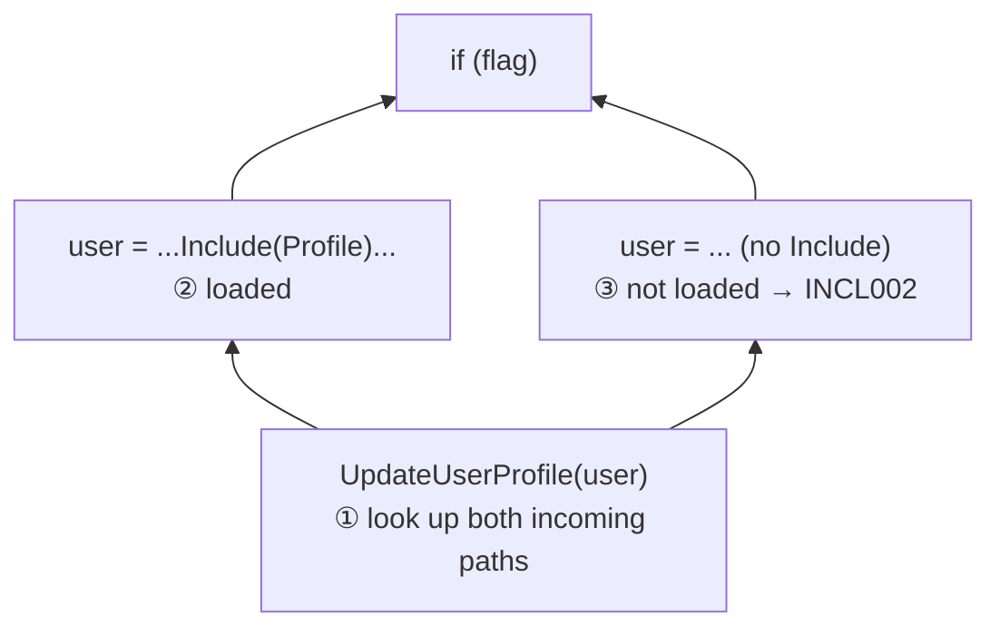

# NavigationInclude analyzer: how it works

For rule descriptions and attribute usage, see the [package README](../../README.md#navigation-include-attributes).

## The approach

The rules check values at two kinds of places:

| Place | Rule |
|---|---|
| a call of an `[IncludeRequired(param, Property)]` method | INCL001 if the argument is the method's own parameter, INCL002 if it is a local or a LINQ lambda parameter |
| a `return` of an `[Includes(Property)]` method | INCL003 (skipped with `Verify = false`) |

INCL001 for direct access (`user.Profile` inside a method) is simpler and handled by `PropertyReferenceHandler`.

At each place the analyzer asks one question: **is `Property` loaded in this value here?** It answers the
same way a person reads code. It **looks backward** from the place for where the variable got its value:

```csharp
var user = await db.Users.Include(u => u.Profile).FirstAsync();
user = await db.Users.FirstAsync();          // ② last assignment: no Include → not loaded
UpdateUserProfile(user, dto);                // ① start here, look up for "user = ..."
```

When several paths lead to the place, the property must be loaded on **every** path. The paths come from
Roslyn's **control flow graph**: the method split into blocks connected by jumps. Roslyn builds it, so `if`,
`switch`, `?:`, `??`, loops, `try` and `foreach` need no special code.



## How it works

There is one black box: **`LoadedPropertySearch.IsLoaded(value, property, position)` → true / false.**

`position` (`CodePosition`) is the statement that contains the value: graph + block + statement index. The
search moves the position backward; its only changing state is the set of blocks already searched.

`IncludeFlowHandler` maps statements to diagnostics and reports them at the end:

```text
statements = FlowGraph.ForMethod(body).GetStatements()   // also lambdas and local functions
diagnostics = for each statement:
    calls of an [IncludeRequired(param, P)] method where not IsLoaded(argument for param, P) → INCL001 / INCL002
    "return value" of an [Includes(P)] method where not IsLoaded(value, P)                   → INCL003
report diagnostics
```

Inside the black box:

```text
IsLoaded(value):
    variable (user, query, u)     → look backward for the variable (below)
    x.Include(u => u.P)           → true
    x.Where / OrderBy / First / ToList / Include(other) / ... → IsLoaded(x)
    x.ToDictionary(u => u.Id)     → IsLoaded(x)   (with an element selector: false)
    x[key], x.Values, pair.Value, x.GetValueOrDefault(key) → IsLoaded(x)
    await x, casts                → IsLoaded(x)
    method with [Includes(P)]     → true
    anything else                 → false

look backward for variable, starting before the statement that uses it:
    go up through the statements of the block:
        "variable = expr"         → answer is IsLoaded(expr)
        "variable.P = expr"       → true
        "var (id, variable) = expr" → IsLoaded(expr)
        "d.TryGetValue(key, out variable)" → IsLoaded(d)   (the if condition is searched too)
    reached the top of the block:
        start of the method       → true only for a parameter with [IncludeRequired(param, P)]
        start of a lambda         → u of users.Select(u => ...): IsLoaded(users); other variables: continue
                                    looking before the statement that creates the lambda
        block already searched    → true (a loop came back; this path adds nothing new)
        otherwise                 → continue in every block that jumps here; all must be true
```

The "block already searched" rule is what makes loops work. The search goes around the loop once, sees every
assignment in the loop body, and stops.

## Files

| File | Responsibility |
|---|---|
| `Handlers/IncludeFlowHandler.cs` | Finds places to check, reports diagnostics. |
| `Flow/LoadedPropertySearch.cs` | The black box `IsLoaded`. |
| `Flow/VariableAssignment.cs` | Mapper: what a statement assigns to a variable (`user = value`, `user.Profile = value`, deconstruction, `out`). |
| `Flow/FlowGraph.cs` | One graph (method, local function or lambda); for a lambda, where it is created. Lists statements. |
| `Flow/CodePosition.cs` | A statement in a graph: block + index. Lists the statements before it. |
| `Flow/LinqMethods.cs` | Facts about LINQ/EF methods: which keep entities, which pass elements to lambdas, `Include` parsing. |
| `Handlers/PropertyReferenceHandler.cs` | INCL001 for direct `param.Profile` access. |

## What the compiler rewrites for us

The graph contains simplified code. Two constructs look different from the source:

| Source | In the graph | Why it works |
|---|---|---|
| `new User { Profile = p }` | `#1 = new User(); #1.Profile = p; user = #1` | backward search for `#1` finds `#1.Profile = p` |
| `foreach (var user in users)` | `#1 = users.GetEnumerator(); ... user = #1.Current` | `Current` and `GetEnumerator` pass through to `users` |
| `flag ? a : b`, `a ?? b` | two blocks assign `#1`, then they merge | both paths are searched |

`#1` is a temporary variable the compiler creates (`IFlowCaptureOperation`). The search treats it like any other
variable.
