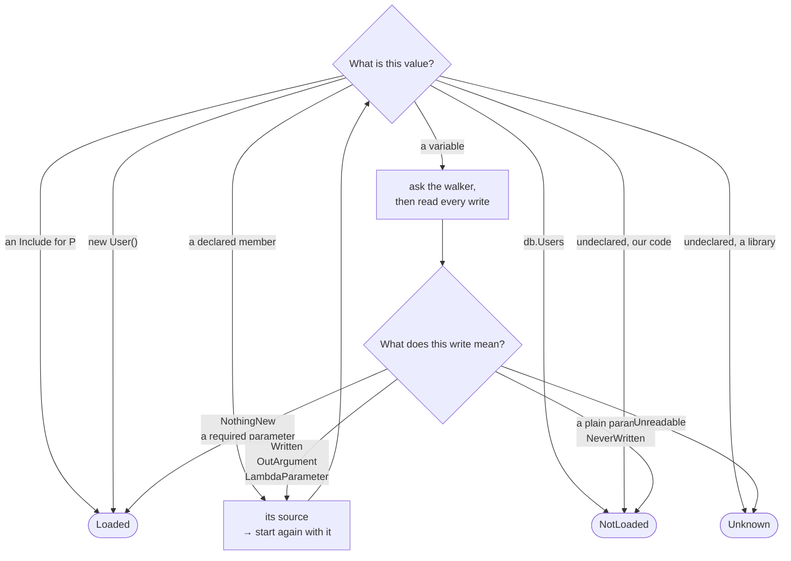
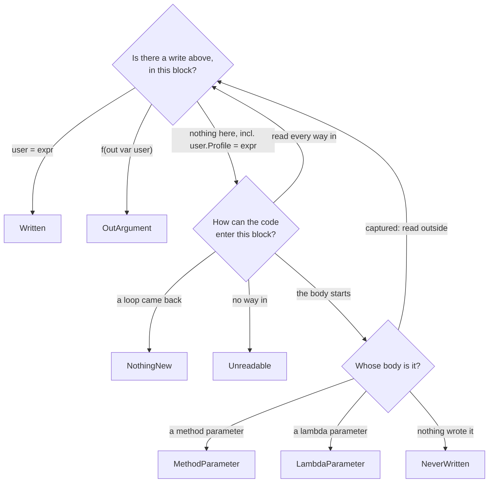

# NavigationInclude analyzer: how it works

This document explains how the NavigationInclude analyzer is built. It is for developers who want to understand
or change it. You do not need to know Roslyn: the few compiler words it uses are explained where they appear.

If you only want to *use* the analyzer, read the [package README](../../README.md#navigation-include-analyzer).

## Contents

1. [Why this analyzer exists](#why-this-analyzer-exists)
2. [What the analyzer checks](#what-the-analyzer-checks)
3. [How it works: one idea, two jobs](#how-it-works-one-idea-two-jobs)
4. [Two examples, step by step](#two-examples-step-by-step)
5. [Bridging](#bridging)
6. [Reading the code: bodies and positions](#reading-the-code-bodies-and-positions)
7. [Special cases](#special-cases)
8. [When the analyzer cannot read the code](#when-the-analyzer-cannot-read-the-code)
9. [Files](#files)

## Why this analyzer exists

In Entity Framework Core, a *navigation property* (for example `user.Profile`) is **not loaded by default**.
It is filled only if the query asks for it with `Include`:

```csharp
var user = await db.Users.FirstAsync(u => u.Id == id);                               // Profile is null
var user = await db.Users.Include(u => u.Profile).FirstAsync(u => u.Id == id);       // Profile is loaded
```

If the code reads `user.Profile.Timezone` and `Include` was forgotten, the program fails at run time with a
`NullReferenceException`. The compiler does not warn about it. This is hard to find, because:

- the query and the code that uses `user.Profile` are often in different methods, or even different classes;
- the code works in tests if the test data happens to have a profile, or if the entity is already in the EF cache;
- somebody can remove an `Include` later and nothing shows that another method needed it.

The analyzer moves this check from run time to compile time. A developer writes the requirement **in the method
that needs the property**, and the analyzer checks **every place that calls the method**:

```csharp
[IncludeRequired(nameof(user), nameof(User.Profile))]   // "who calls me must load Profile"
void UpdateProfile(User user, string timezone)
    => user.Profile.Timezone = timezone;

async Task Handle(int id)
{
    var user = await db.Users.Include(u => u.Profile).FirstAsync(u => u.Id == id);
    UpdateProfile(user, "UTC");          // OK: Profile is loaded
}

async Task HandleBroken(int id)
{
    var user = await db.Users.FirstAsync(u => u.Id == id);
    UpdateProfile(user, "UTC");          // warning: Profile is not loaded
}
```

This is the example used in the rest of this document.

## What the analyzer checks

Two kinds of places, and both ask the same thing about one value:

| Place | What is checked | Rule |
|---|---|---|
| a call of a method with `[IncludeRequired(param, Property)]` | the argument for `param` must have `Property` loaded | INCL001 if the argument is a parameter of the current method, INCL002 if it is a local variable or a lambda parameter |
| a `return` in a method with `[Includes(Property)]` | the returned value must have `Property` loaded | INCL003 (not checked if `Verify = false`) |

Reading `user.Profile` directly inside a method is also INCL001. That case needs no search at all and is handled
by `PropertyReferenceHandler` alone. The rest of this document is about the other two.

Three more results come out of the search itself. **INCL004** means *the analyzer could not read the code far
enough to decide*; it is a warning with a code fix, see
[When the analyzer cannot read the code](#when-the-analyzer-cannot-read-the-code). **INCL005** and **INCL006**
are about the bridges themselves: one names a member that does not exist, the other describes a method the
rules do not allow, see [Bridging](#bridging).

## How it works: one idea, two jobs

### The idea

At each checked place the analyzer asks:

> **Is the property loaded in this value, at this point of the code?**

A value does not say by itself whether its property is loaded, so the analyzer does what a person does when
reading code: it goes **backward**, to the place where the value was made.

```csharp
var user = await db.Users.Include(u => u.Profile).FirstAsync();
user = await db.Users.FirstAsync();          // ② the last write has no Include → not loaded
UpdateUserProfile(user, dto);                // ① start here, look up for "user = ..."
```

Sometimes several paths lead to the same place, for example after an `if`. Then the property must be loaded on
**every** path. The paths come from Roslyn's *control flow graph* — its picture of a method as blocks of
statements connected by arrows — so the analyzer needs no special code for `if`, `switch`, `?:`, `??`, loops,
`try` or `foreach`.

### The four words the code is built from

| Word | Meaning | File |
|---|---|---|
| **Value** | a place where entities sit: a variable, a parameter, an argument or the result of an expression, together with the position in the code where it is read | `Search/Value.cs` |
| **Answer** | what the search decided: `Loaded`, `NotLoaded` or `Unknown` | `Search/Answer.cs` |
| **Write** | one thing found above a variable: `Written`, `OutArgument`, `MethodParameter`, `LambdaParameter`, `NothingNew`, `NeverWritten`, `Unreadable` | `Search/Write.cs` |
| **Bridge** | a declared move from one value to another that keeps the same entities: `Where`, `ToList`, `page.Items`, an indexer. A pair of `BridgeEnd`s, read backwards | `Bridging/Bridge.cs` |

A value is a question and an answer is a decision, and the code never mixes the two. A write is a fact about the
code and never a decision.

### The two jobs

The search itself is one function, `IncludeSearcher.Check(value, property, position)`, and two classes share the
work behind it:

| Class | Its question | What it knows | What it never does |
|---|---|---|---|
| `IncludeSearcher` | does this value have the include? | `Include`, bridges, the three answers | read blocks or statements |
| `WritesWalker` | where was this variable written? | statements, blocks, `if`, loops, `try`, lambdas | decide anything |

The walker reports writes, `IncludeSearcher` says what they mean, and only `IncludeSearcher` calls the walker,
never the other way round. Only the walker needs memory: it remembers the blocks it has already read, which is
what stops a loop from walking forever.

The whole search is these two jobs calling each other back:

```text
Check(value):
    IncludeSearcher reads the value
        it was made from another value  → start again with that one
        it is a variable                → ask the walker where it was written
                                          the walker reports one write per path
                                          IncludeSearcher reads each write, and gets
                                          an answer or a new value to start again with
        anything else                   → an answer

    every path must end at Loaded
```

### What IncludeSearcher does

It has two questions: what a value is, and what a write of the walker means. Both end at an answer, or at a
new value to start again with. The tables under the diagrams say which code each label stands for.



### How the walker finds the writes

It only reads code. Every arrow that ends in a box is a write it reports, and `IncludeSearcher` is the one that
says what the write means. "Read every way in" means every block that jumps here, and for a `catch` or a
`finally` every place inside the `try` as well.



Two rules are in neither diagram:

1. When a step gives **several** values (the two ways into a block after an `if`, or two sources of one call),
   **every one** of them must end at `Loaded`. The first one that does not gives the answer.
2. A dead end is never "nothing". It is always `NotLoaded` or `Unknown`, so a path that leads nowhere cannot
   silently disappear from the check.

### Where each path ends

| Ending | Answer | Example |
|---|---|---|
| an `Include()` for the property | `Loaded` | `db.Users.Include(u => u.Profile)` |
| a method that promises it | `Loaded` | `[Includes("Profile")] Task<User> GetUser()` |
| a parameter the method requires loaded | `Loaded` | `[IncludeRequired(nameof(user), "Profile")] void Update(User user)` |
| a loop that came back to a block already read | `Loaded` | `while (…) { … }` — this path adds nothing new |
| a freshly constructed object | `Loaded` | `new User()`, `new List<User>()` — it was not sourced from a query, so there was no Include to miss |
| a value the search can read to its start | `NotLoaded` | `db.Users`, a method of this project that promises nothing |
| a method parameter without the attribute | `NotLoaded` | reported as INCL001, which asks for `[IncludeRequired]` |
| unreachable code | `Unknown` | no block jumps there |
| a call nobody declared, in another assembly | `Unknown` | `query.Paginate(1)` from a library |
| a lambda parameter that is not a LINQ element | `Unknown` | `Select((u, i) => …)`, a lambda given to a method that is not LINQ |
| an `out` argument of a method nobody declared | `Unknown` | `Compute(out var user)`, while `d.TryGetValue(k, out var user)` follows `d`, because `TryGetValue` is declared |

`NotLoaded` is a mistake in the user's code and `Unknown` is a limit of the analyzer. They must not be mixed,
because a wrong warning is worse than no warning.

### What the walker reports

For one statement it returns a write, or nothing, which means "this statement says nothing, keep reading
upward":

| Statement | Write | What `IncludeSearcher` makes of it |
|---|---|---|
| `user = expr`, `var user = expr` | `Written(expr)` | read `expr` |
| `user.Profile = expr` | none | keep reading upward — finding whether an Include happened is the search's job, not this |
| `user.Other = expr` | none | keep reading upward |
| `var (id, user) = pair` | `Written(pair)` | read `pair` |
| `d.TryGetValue(key, out var user)` | `OutArgument(the call)` | read the call's source, if it is declared |
| does not touch the variable | none | keep reading upward |

At the start of a body it reports `MethodParameter` or `LambdaParameter` instead, and around a loop
`NothingNew`. A "variable" here is a local, a parameter or a temporary the compiler made (`#1`), see
[Special cases](#special-cases).

## Two examples, step by step

### Example 1: a straight line

```csharp
var user = await db.Users.Include(u => u.Profile).FirstAsync(u => u.Id == id);
UpdateProfile(user, "UTC");          // ← the analyzer checks this argument
```

```text
Value( user , before "UpdateProfile(user, …)" )
      a variable → the walker reports the write "var user = await …"
Value( db.Users.Include(u => u.Profile).FirstAsync(…) , before "var user = …" )
      "await" is removed when the value is created
      FirstAsync has a bridge: it hands back the entities it was called on → look at the source
Value( db.Users.Include(u => u.Profile) , before "var user = …" )
      Include names Profile
Answer.Loaded                                    → nothing is reported
```

Without the `Include`, the last two steps become `Value( db.Users , … )` → `NotLoaded`, and the analyzer reports
INCL002.

### Example 2: a branch

Here the search must check two paths, and they give different answers:

```csharp
1   var query = db.Users.AsQueryable();
2   if (withProfile)
3   {
4       query = query.Include(u => u.Profile);
5   }
6
7   var user = await query.FirstAsync();
8   UpdateProfile(user, "UTC");        // [IncludeRequired(nameof(user), "Profile")]
```

```text
① Value( user , before line 8 )
     a variable → the walker reads the block upward → line 7 writes it

② Value( query.FirstAsync() , before line 7 )     "await" is removed
     FirstAsync hands back the same entities → look at the source

③ Value( query , before line 7 )
     a variable again → nothing above line 7 in this block
     → the walker reports one write per way into the block, and BOTH must end at Loaded:

     ├─ way A — from the end of the "if" body
     │  ④ Value( query.Include(u => u.Profile) , before line 4 )
     │  ⑤ Answer.Loaded                                                          ✓
     │
     └─ way B — from the block before the "if"
        ⑥ Value( db.Users.AsQueryable() , before line 1 )
             AsQueryable hands back the same entities → look at the source
        ⑦ Value( db.Users , before line 1 )
             a DbSet property — no bridge describes it
        ⑧ Answer.NotLoaded                                                       ✗

Every way must be Loaded → the answer is not Loaded → INCL002 on line 8
```

A value has two parts, and the two jobs change them differently:

- **②→③ and ⑥→⑦ change only the value.** The position stays the same, because one call is removed from the
  chain. This is `IncludeSearcher` reading an expression.
- **①→②, ③→④ and ③→⑥ also change the position.** The search moves to another statement, another block or out of
  a lambda. This happens only for a variable, and it is the `WritesWalker`.

### Example 3: a value made of many steps

One value can be a whole chain. Here every kind of step appears once:

```csharp
1   var page = await db.Users.Include(u => u.Profile).Paginate(1);
2   foreach (var user in page.Items)
3   {
4       UpdateProfile(user, "UTC");     // [IncludeRequired(nameof(user), "Profile")]
5   }
```

`Paginate` is a library method, declared once for the solution, and `Items` is its property:

```csharp
[assembly: PassesIncludes(typeof(SomeLib.QueryExtensions), "Paginate", "query")]
[assembly: PassesIncludes(typeof(SomeLib.PagedResult<>), "Items")]
```

```text
① Value( user , before line 4 )
     a variable → the walker finds what "foreach" became: "user = #1.Current"

② Value( #1.Current , inside the loop )
     Current is declared on IEnumerator<T> → look at the object it is read on

③ Value( #1 , inside the loop )
     a temporary, still a variable → the walker finds "#1 = page.Items.GetEnumerator()"

④ Value( page.Items.GetEnumerator() , before the loop )
     GetEnumerator is declared on IEnumerable<T> → look at the source

⑤ Value( page.Items , before the loop )
     Items is declared on PagedResult<T> → look at the object it is read on

⑥ Value( page , before the loop )
     a variable again → line 1 writes it

⑦ Value( db.Users.Include(u => u.Profile).Paginate(1) , before line 1 )
     "await" is removed; Paginate is declared with the parameter "query"
     → look at the argument passed for that parameter, not at the result

⑧ Value( db.Users.Include(u => u.Profile) , before line 1 )
⑨ Answer.Loaded                                                              ✓
```

Steps ②, ④, ⑤ and ⑦ are transformations, ①, ③ and ⑥ are the walker, and nothing in this chain needed a rule of
its own: `foreach`, the enumerator, the indexer-like property and the library method are all bridges.

If the `Items` bridge were missing, step ⑤ would end at `Unknown` and the analyzer would report INCL004 on
line 4, with a code fix that writes it.

## Bridging

A **bridge** is a declared move of entities across a call: the objects coming out are the same ones that went
in. It is what lets the search take one more step. A member is followed **only if a bridge is declared for
it** — there is no guessing from types, and no special code for `System.Linq` or EF Core.

A bridge says nothing about *which* property is loaded, only where the entities travelled. That is why one
declaration covers every navigation property.

### The four moves

A call offers three places where entities can sit, so `BridgeEnd` has three cases:

| End | Means |
|---|---|
| `Result` | what the call handed back |
| `Instance` | what it was used on; for an extension method, its first parameter |
| `Parameter(name, lambdaPosition)` | something passed to it |

A `Bridge` is a pair of them, read backwards: `From` is where the search is standing, `To` is where it goes
next. Only four pairs are meaningful, because the search always stands on a result or on something that
arrived through a parameter, and only ever moves backwards:

| From | To | Example | Moves to |
|---|---|---|---|
| `Result` | `Instance` | `users.ToList()`, `users[0]`, `page.Items` | `users`, `page` |
| `Result` | `Parameter` | `Enumerable.ToList(users)` | `users` |
| `Parameter` | `Instance` | `dict.TryGetValue(id, out var user)` | `dict` |
| `Parameter` | `Parameter` | `Enumerable.Select(query, selector)` | `query` |

`From` is never `Instance` and `To` is never `Result`. Both are asserted in the `Bridge` constructor and
covered by the built-in table test.

The shape of the move does not matter to the search — collection to collection, collection to one value, one
value to collection, one value to another are all the same thing. What matters is only that the entities on
both sides are the same objects.

### One end for three shapes

`Parameter` covers an ordinary argument, an `out` argument the call wrote, and a parameter of a callback the
call was given. The search only needs to know which parameter the entities travelled through, and a parameter
is never both an `out` and a callback, so the three cannot collide. `BuiltInBridges` still spells them
differently, so a reader sees which is which:

```csharp
Declare(type,       member: "Select",      from: Callback("selector"),          to: Instance),
Declare(type,       member: "Aggregate",   from: Callback("func", position: 1), to: Instance),
Declare(Dictionary, member: "TryGetValue", from: OutArgument("value"),          to: Instance),
Declare(type,       member: "Join",        from: Callback("innerKeySelector"),  to: Parameter("inner")),
```

### Why the lambda position is written down

A callback is handed values from more than one place, and their **types cannot tell them apart**:

| Lambda | Position 0 | Position 1 |
|---|---|---|
| `Select(u => ...)` | the element | — |
| `Select((u, i) => ...)` | the element | an index, not an entity |
| `GroupBy(k, (key, group) => ...)` | the key | the group |
| `Aggregate(seed, (acc, u) => ...)` | the accumulator, **same type as the element** | the element |
| `Join(..., (outer, inner) => ...)` | from the outer collection | from the inner one |

An earlier attempt replaced the position with a type comparison and fell over on `Aggregate` and self-joins,
where both parameters are the same type. The position is data, not something to infer. Nothing is inferred
from the delegate type either: a parameter nobody named is not followed, which is why the search stops at the
`i` of `Select((u, i) => ...)`.

### Built-in bridges

`BuiltInBridges.cs` holds the table, one line per member of `System.Linq`, EF Core and the collection types.
Each line means exactly what a `[PassesIncludes]` means and goes through the same lookup, so nothing about
Microsoft's methods is special.

Types are named by metadata string, so the analyzer does not depend on EF Core, and a line for a type the
project does not use simply matches nothing. A line on an interface covers every class implementing it, so
`IEnumerable<T>.GetEnumerator` covers the one `foreach` calls on a `List`, and `IList<T>` covers the indexer
of `List<T>`.

`Enumerable` and `Queryable` declare most operators identically, so those are written once in
`QueryOperators` and read for both. Keeping two hand-written copies in step is how `Queryable` once came to
claim a `ToDictionary` it does not have.

`Select` and `SelectMany` have no result line. They make new objects, so their result has no includes.

### Overloads that disagree

A line names a member, and a member can be several overloads that do different things:

```csharp
users.Min()                  // an element
users.Min(comparer)          // an element
users.Min(u => u.Manager)    // whatever the selector returned - which is also a User
```

Neither the parameter count nor the types can separate them, so the odd ones out are named:

```csharp
Declare(type, member: "Min", from: Result, to: Instance, excludeOverloadsWithParameters: ["selector"]),
```

Six members need this: `Min`, `Max`, `ToDictionary` and their EF `Async` twins. Renaming a public BCL
parameter is source-breaking, because callers may pass by name, so the name is safe to lean on. What a name
cannot see is a future overload that projects under some other parameter name, which would silently widen the
line — the only place in the subsystem where a string failing to match makes the analyzer *more* permissive.

An entity-type comparison was tried here instead and does not work: `users.Min(u => u.Manager)` hands back a
`User` just as `users.Min()` does. See `CustomBridgeRules.EntityType`, which is why that code is nested out of
reach of the table.

### Custom bridges and their rules

Three places declare a bridge, and `Bridges.Find` asks them in order — the member itself has the last word,
then the built-in table, then an assembly attribute:

| Where | Example |
|---|---|
| on the member | `[PassesIncludes(nameof(query))] static PagedList<User> Paginate(this IQueryable<User> query, int page)` |
| on an assembly, the project or anything it references | `[assembly: PassesIncludes(typeof(SomeLib.Ext), "Paginate", "query")]` |
| built into the analyzer | `BuiltInBridges.cs` |

`PassesIncludesReader` turns the attribute into a `Bridge`, so the lookup and the rule that reports INCL006
cannot read it differently. An assembly attribute names the member by string and so speaks for every overload
at once; it therefore carries no overload data, and it is ignored for a property, which keeps every property
bridge one we can verify by reading it.

What somebody writes is a promise the analyzer cannot check, so `CustomBridgeRules` allows only the shapes
where it cannot quietly be false. Both are reported as **INCL006** and otherwise ignored:

| Rule | Why |
|---|---|
| the method must be **static** | an instance method can change what it was called on, or hand back something built from a field, and the declaration would still look right |
| the **entity type must not change** | otherwise nobody reading the code can say which query a value came from, which is the question the analyzer exists to answer |

The type check strips containers from both sides — `Task`, `Nullable`, arrays, anything enumerable, with
dictionaries and groupings holding their entities in the last argument — and the leaves must match. A
container of somebody's own is not on that list, so a bridge into one is rejected: it looks the same as a
bridge to an unrelated entity, and making it implement `IEnumerable<T>` is what tells the two apart. A type
that says nothing at all, such as `object` or one that did not compile, is let through.

None of this applies to `BuiltInBridge`, which is ours and is checked by being read. That is why `EntityType`
is a private class inside `CustomBridgeRules` rather than a type of its own.

### More than one bridge at once

`Bridges.Find` returns **every** matching end, not the first. Equal ends are collapsed, which is not cosmetic:
a `Dictionary<K,V>` is both an `IDictionary` and an `IReadOnlyDictionary`, so its `TryGetValue` matches two
lines meaning the same one place.

Two different ends mean the entities could have come from either place. `IncludeSearcher.SearchSources` is the
only place that decides what that is worth, and today it answers `Unknown`:

```csharp
private Answer SearchSources(IReadOnlyList<IOperation> sources, CodePosition position)
    => sources.Count == 1
        ? Search(sources[0], position)
        : Answer.Unknown();
```

When fan-out is implemented — "all of them must be loaded" — that method is the only one that changes.

### What is deliberately not crossed

| Not crossed | Why |
|---|---|
| `Concat`, `Union`, `UnionBy`, `Append`, `Prepend` | the result holds the entities of two places, and one line names one. `BuiltInBridges.IsLeftOutOnPurpose` names them, so the INCL004 code fix does not offer to declare them back |
| `Except`, `ExceptBy`, `Intersect`, `IntersectBy` **are** crossed | they hand back elements of the collection they were used on; what they are given is only matched against, and for the `By` pair it is a list of keys |
| a property of a library type, such as `page.Items` | an attribute cannot be written on a property, and one naming a property by string is ignored |
| `Cast<T>`, `OfType<T>` | the entity type changes |
| the `f` of `SelectMany(u => u.Friends, (u, f) => ...)` | it came from `u.Friends`, not from the query, so it carries different includes. Following it would need to read the lambda's returned value, which is not done |

Two things are not bridges at all, because there is nothing to name: an array element, `users[0]` over
`User[]`, which Roslyn exposes no member for and which can come from only one value, and `.Include(...)`
itself.

### `EfIncludeReader`: the only code that knows Entity Framework

Every other rule answers "do the entities pass through this call?", which a bridge can say. This one answers
"which property was added?", and no general rule can do that:

```csharp
query.Include(u => u.Profile)   // the analyzer must read the name "Profile" from the lambda
```

It is a bridge as well: `Include(u => u.Orders)` does not load `Profile`, so the search keeps walking back
through it.

## Reading the code: bodies and positions

`FlowGraph` is one body being analyzed — a method, constructor, local function or lambda — with its control
flow graph from Roslyn. `IncludeFlowHandler` walks its statements, finds the places to check and reports the
results.

A lambda that becomes a delegate is the difficult case. It has a graph of its own, and the statement that
creates it holds only a reference. `FlowGraph.CreationStatement` is the way back, so a variable captured by a
lambda can be followed out into the method around it:

```csharp
var users = await db.Users.Include(u => u.Profile).ToListAsync();
var timezones = users.Select(u => GetTimezone(u, dto)).ToList();
//                          └─ this lambda has its own FlowGraph. Its CreationStatement is the line
//                             "var timezones = …", and from there "u" is followed back to "users".
```

A lambda passed to `IQueryable` becomes an expression tree, which is data rather than code, but it still has a
graph and is still searched. Its parameter is declared `Expression<Func<TSource, TResult>>`, and the search
reads through the expression to the same `TSource`, so `u` in `query.Select(u => ...)` is filled from `query`.
`Include(u => u.Profile)` is the one lambda read from syntax instead, because there the analyzer needs the
property name and not the entities.

`CodePosition` is a point in execution: a graph, a block, and the number of statements of that block that have
already run. One position answers both questions a backward search needs — `Statement` is the statement that
runs next, and `GetPreviousStatements()` gives the ones that already ran, the nearest first.

## Special cases

### What the compiler rewrites

The control flow graph holds simplified code. Three constructs look different from the source:

| Source | In the graph | Why the search still works |
|---|---|---|
| `new User { Profile = p }` | `#1 = new User(); #1.Profile = p; user = #1` | `#1.Profile = p` is skipped; walking back for `#1` reaches the fresh `new User()` |
| `foreach (var user in users)` | `#1 = users.GetEnumerator(); … user = #1.Current` | `GetEnumerator` and `Current` are declared, so they pass through to `users`. Over an array the old non-generic `IEnumerator` is used, and it is declared too. |
| `flag ? a : b`, `a ?? b` | two blocks write `#1`, then they join | both paths are searched |

`#1` is a temporary variable the compiler creates. The walker treats it as any other variable.

### Loops

A loop goes back to a block that was already read. The walker remembers the blocks it has read; when it comes
back to one it reports `NothingNew`, and the search counts that path as `Loaded` because it adds nothing. So
the search goes around a loop once, reads every write in the loop body, and stops.

### Exceptions

The graph has no jumps for exceptions. The first block of a `catch`, a `catch when` filter or a `finally` has no
incoming jumps, so it looks unreachable. But an exception can leave the `try` block after any statement, so
**every place inside the `try`** counts as a way into the handler. For a `finally` after `try/catch`, the
`catch` blocks are included too. This is the only reason the walker does more than `block.Predecessors`.

## When the analyzer cannot read the code

The analyzer follows only members a bridge is declared for. `System.Linq`, EF Core and the collection types are declared in the
analyzer, so they work with no setup. Anything else has to be declared by the project:

```csharp
var page = query.Paginate(1);   // a library method: nobody declared it
var user = page.Items[0];       // a library property: nobody declared it
```

For a library, the analyzer reports **INCL004**: it cannot read the code. For a method in the project's own
code it reports **INCL002** instead, because that method can be read and it promises nothing. In both cases the
fix is `[PassesIncludes]`, which means "this member returns the entities that it was given":

```csharp
[PassesIncludes(nameof(query))]                      // names the parameter the entities come from
public static PagedResult<User> Paginate(this IQueryable<User> query, int page)
```

For a library the project does not own, the attribute goes on the assembly, before the namespace:

```csharp
[assembly: PassesIncludes(typeof(SomeLib.QueryExtensions), "Paginate", "query")]
```

A property cannot be declared this way, so a library that hands its entities back through one, such as
`page.Items`, cannot be followed unless its type is enumerable.

Assembly attributes are read from the project itself and from every project and package it references, so a
shared project can declare a library once for the whole solution. If such an attribute names a member or a
parameter that does not exist, for example after the library renamed a method, the analyzer reports **INCL005**;
without it the bridge would silently stop working. A declaration the rules do not allow is **INCL006**, and is
ignored the same way.

Users do not have to write these by hand. The code fix for INCL004 offers them and creates the file
`NavigationIncludes.cs` if the project has none yet, the way Visual Studio uses `GlobalSuppressions.cs`.

The attribute does not say *which* property is loaded. It only says **where the entities come from**, and the
search continues from there.

## Files

The folders are subsystems, each answering one question. A class that mostly *does* something is named for the
job it does — `IncludeSearcher`, `WritesWalker`, `BridgeCrosser`, `EfIncludeReader` — and a class that mostly
*is* something keeps a plain noun: `Value`, `Write`, `Answer`, `Bridge`.

**`Search/` — is the property loaded in this value?**

| File | What it does |
|---|---|
| `IncludeSearcher.cs` | The only class that decides. `Check`: reads a value, asks the walker, joins the paths. |
| `WritesWalker.cs` | Where a variable was written: the backward walk through statements, blocks and bodies. |
| `Write.cs` | One thing the walker found. A fact about the code, never a decision. |
| `Value.cs` | What the search looks at: an expression and the position it is read at. |
| `Answer.cs` | What the search decided: `Loaded` / `NotLoaded` / `Unknown`. |
| `CodePosition.cs` | A point in execution: graph + block + number of statements already run. |
| `FlowGraph.cs` | One body and its control flow graph. Lists its statements, lambdas and local functions included. |

**`Bridging/` — may the entities move, and where from?**

| File | What it does |
|---|---|
| `Bridge.cs` | One declared move of entities: a `From` end and a `To` end, nothing else. |
| `BridgeEnd.cs` | One side of a move: `Result`, `Instance` or `Parameter(name, lambdaPosition)`. |
| `Bridges.cs` | Every bridge the compilation can see, the built-in ones included, and the lookups over them. The only place that decides what is followed. |
| `BuiltInBridges.cs` | The catalogue: one line per member of `System.Linq`, EF Core and the collection types that the search may cross. |
| `BuiltInBridge.cs` | One line of that catalogue: the member, the move, and which overloads it describes. |
| `CustomBridge.cs` | One `[assembly: PassesIncludes]`: the member and the move, with the type already resolved. |
| `CustomBridgeRules.cs` | What a bridge somebody writes may say, and the container table behind the entity-type rule. |
| `PassesIncludesReader.cs` | The attribute, turned into a `Bridge` once for everyone who reads it. |
| `BridgeCrosser.cs` | Which values the entities came from, one method per shape the search stands on. The only file that walks bridges. |

**`Rules/` — what do we report?**

| File | What it does |
|---|---|
| `IncludeFlowHandler.cs` | Finds the places to check, calls `Check`, reports INCL001 – INCL004. |
| `PropertyReferenceHandler.cs` | INCL001 for direct `param.Profile` access, without flow analysis. |
| `BridgeAttributeHandler.cs` | INCL005 and INCL006: a `[PassesIncludes]` that names nothing, or that the rules do not allow. |
| `NavigationIncludeRulesProvider.cs` | The diagnostic descriptors and their ids. |
| `UnreadableMember.cs` | The member that stopped the search. INCL004 carries it for the code fix. |

**`Requirements/` — what did the author ask for?**

| File | What it does |
|---|---|
| `AttributeReader.cs` | Reads `[IncludeRequired]`, `[Includes]` and `[TrackIncludeRequired]` from symbols. |
| `IncludeRequirement.cs` | One `[IncludeRequired(parameter, property)]` pair. |

**The rest**

| File | What it does |
|---|---|
| `NavigationIncludeAnalyzer.cs` | Registers the three handlers in Roslyn. |
| `EntityFramework/EfIncludeReader.cs` | The only rule that knows EF: reads the property name from `Include(u => u.Profile)`. |
| `Roslyn/RoslynReader.cs` | Roslyn details with no meaning of their own: wrappers, the receiver of a call, the types inside a type, a delegate parameter. |
| `CodeFixes/PassesIncludesCodeFixProvider.cs` | The code fix for INCL004: writes a `[PassesIncludes]` attribute. |
