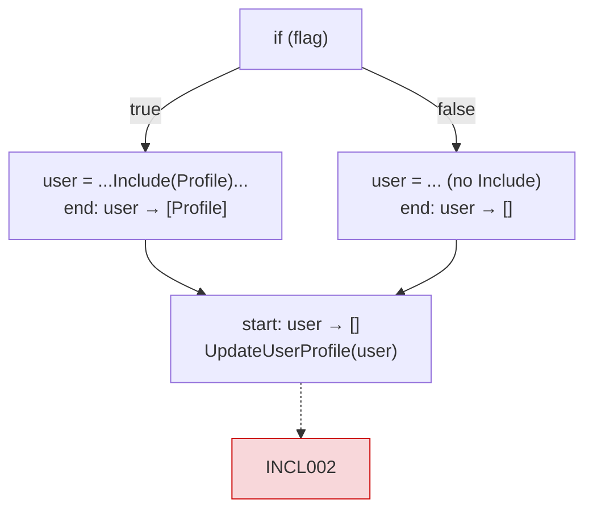
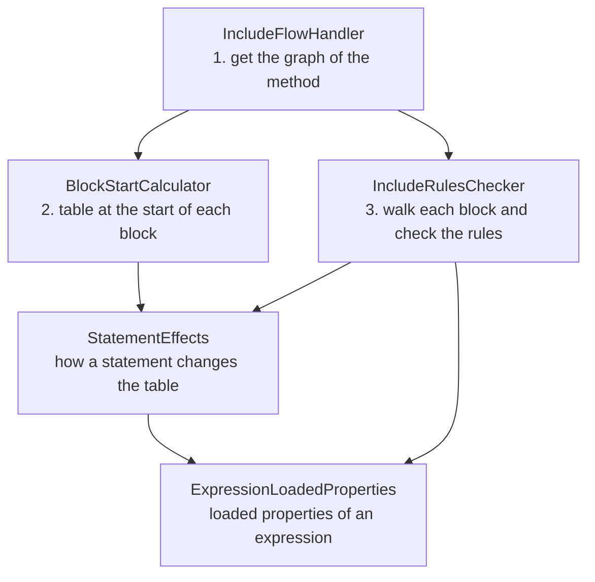

# NavigationInclude analyzer: how it works

For rule descriptions and attribute usage, see the [package README](../../README.md#navigation-include-attributes).

## The approach

All rules except "direct property access" ask one question:

> **Is the navigation property loaded for this value at this exact point of the method?**

| Rule | Value checked |
|---|---|
| INCL001 | the method's own parameter, passed to an `[IncludeRequired]` method |
| INCL002 | a local (or LINQ lambda parameter), passed to an `[IncludeRequired]` method |
| INCL003 | the value returned from an `[Includes]` method (skipped with `Verify = false`) |

INCL001 for direct access (`user.Profile` inside a method) needs no flow and is handled by `PropertyReferenceHandler`.

To answer the question, the analyzer keeps a table **variable → loaded navigation properties**
(`LoadedProperties`) and updates it statement by statement:

```csharp
var user = await db.Users.Include(u => u.Profile).FirstAsync();  // user → [Profile]
user = await db.Users.FirstAsync();                              // user → []   (replaced)
UpdateUserProfile(user, dto);                                    // needs Profile → INCL002
```

Branches are handled with Roslyn's **control flow graph**: the method split into straight-line blocks connected
by jumps. Roslyn builds it for us, so `if`, `switch`, `?:`, `??`, `try` and `foreach` need no special code.
When several blocks jump into one block, a property stays loaded only if it is loaded in all of them:



## How it works



```text
IncludeFlowHandler.Analyze(method):
    graph = Roslyn.GetControlFlowGraph(method body)
    IncludeRulesChecker.CheckGraph(graph, table from [IncludeRequired] on parameters)

IncludeRulesChecker.CheckGraph(graph, tableAtStart):
    tablesAtBlockStart = BlockStartCalculator.CalculateTableAtStartOfEachBlock(graph, tableAtStart)
    for each block:
        table = tablesAtBlockStart[block]
        for each statement in block:
            CheckStatement(statement, table)          // INCL001 / INCL002, lambdas
            table = StatementEffects.UpdateTableForStatement(statement, table)
        if block ends with "return value":
            CheckReturnedValue(value, table)          // INCL003

BlockStartCalculator.CalculateTableAtStartOfEachBlock(graph, tableAtStart):
    for each block in order:
        start = KeepOnlyWhatAllTablesAgreeOn(end tables of blocks jumping here)
        end   = UpdateTableForStatement for every statement, starting from start
```

| Class | Responsibility |
|---|---|
| `LoadedProperties` | The table. Immutable; `SetProperties`, `AddProperty`, `KeepOnlyWhatAllTablesAgreeOn`. |
| `StatementEffects` | The only place the table changes (see below). |
| `ExpressionLoadedProperties` | Loaded properties of an expression; only reads the table. |
| `BlockStartCalculator` | Table at the start of every block. |
| `IncludeRulesChecker` | Walks the blocks, reports diagnostics, analyzes lambdas. |
| `IncludeFlowHandler` | Entry point; also analyzes local functions with their own attributes. |

**How a statement changes the table** (`StatementEffects`):

| Statement | Effect |
|---|---|
| `x = expr` / `var x = expr` | `x → properties of expr` (replaces the old value) |
| `x.Profile = expr` | adds `Profile` to `x` |
| compiler temporary `#1 = expr` | `#1 → properties of expr` |

**Loaded properties of an expression** (`ExpressionLoadedProperties`):

| Expression | Result |
|---|---|
| variable | its row in the table |
| `src.Include(u => u.Profile)` | properties of `src` + `Profile` |
| `Where`, `OrderBy`, `Skip`, `Take`, `AsNoTracking`, `First…`, `ToList…` (sync or async) | properties of `src` |
| `await x`, casts | properties of `x` |
| method with `[Includes("X")]` | `[X]` |
| `Select`, unknown methods, `dbContext.Users`, fields | `[]` |

**Lambdas** have their own graph and are checked with `CheckGraph` too. They start with the table of the place
where they are created. For `users.Select(u => ...)`, `u` gets the properties of `users`.

**What the compiler rewrites for us** (why no special code is needed):

| Code | In the graph |
|---|---|
| `new User { Profile = p }` | `#1 = new User(); #1.Profile = p; user = #1` |
| `foreach (var user in users)` | `#1 = users.GetEnumerator(); user = #1.Current` |
| `flag ? a : b`, `a ?? b` | two blocks assign `#1`, then the blocks merge |

## Loops (not supported yet)

A loop jumps from its end back to its start. `BlockStartCalculator` makes a single pass in block order and ignores
these backward jumps, so a loop body is analyzed as if it runs once. A reassignment at the end of a loop body is
not seen at the start of the next iteration.

To add loop support, repeat the pass in `BlockStartCalculator.CalculateTableAtStartOfEachBlock` until no table at
a block end changes. Tables only lose properties when blocks merge, so the repetition always stops.
