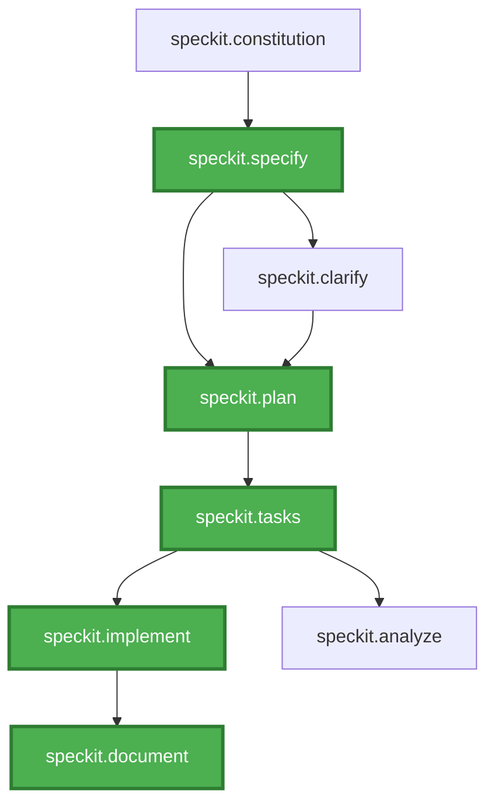

# Saritasa.Tools.SpecKit

Saritasa.Tools.SpecKit is a lightweight LLM framework that combines the benefits of the SDD (Specification Driven Development) approach and AI-powered code generation

## Overview

This package serves as both an MCP (Model Context Protocol) server and a self-extracting package containing all necessary artifacts and tools for the Spec Kit workflow.

## Installation

To set up Spec Kit in your project:

1. Navigate to your solution file directory.
2. Install Spec Kit by running:

   ```
   dotnet tool exec Saritasa.Tools.SpecKit@0.1.0 -- install [-d|--destination <PATH>]
   ```

   Alternatively, using the legacy `dnx` command:

   ```
   dnx Saritasa.Tools.SpecKit@0.1.0 -- install [-d|--destination <PATH>]
   ```

   This extracts artifacts (agents, prompts, memory files) to your project directory. Installing near the solution file enables IDE's Copilot to discover and utilize the agents and prompts.

3. Configure the MCP server in your IDE's Copilot settings by adding:

   ```json
   "spec-kit": {
     "type": "stdio",
     "command": "dnx",
     "args": ["Saritasa.Tools.SpecKit@0.1.0", "--source", "https://api.nuget.org/v3/index.json", "--yes"]
   }
   ```

   Refer to this [guide](https://docs.github.com/en/copilot/how-tos/provide-context/use-mcp/extend-copilot-chat-with-mcp) and select your IDE to learn how to integrate MCP servers.

## Available Agents

| Agent                  | Purpose                                                                 |
|------------------------|-------------------------------------------------------------------------|
| `speckit.constitution` | Create or update project constitution with non-negotiable principles and rules |
| `speckit.specify`      | Generate or update feature specifications from natural language descriptions |
| `speckit.plan`         | Develop technical implementation plans including architecture, data models, and contracts based on specifications |
| `speckit.tasks`        | Produce dependency-ordered, actionable task lists from technical plans |
| `speckit.implement`    | Execute implementation by processing task lists phase by phase         |
| `speckit.document`     | Summarize spec files and prepare documentation                          |
| `speckit.clarify`      | Identify underspecified areas and pose targeted clarification questions |
| `speckit.analyze`      | Perform read-only consistency analysis across spec, plan, and task artifacts |

## Agent Workflow

The following diagram illustrates the interconnections between agents. **Green blocks** denote the primary workflow agents that constitute the core specification-to-implementation pipeline. The remaining agents offer supplementary functions such as clarification, analysis, and documentation.

