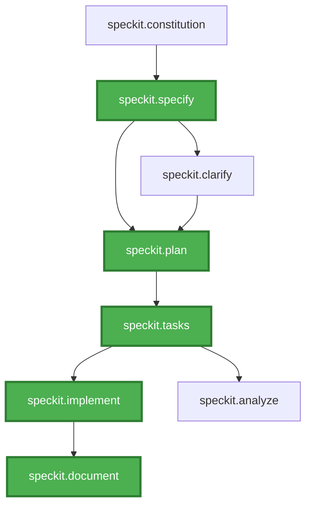

# .NET Spec Kit

## Description

.NET Spec Kit is a lightweight LLM framework that combines the benefits of the SDD (Specification Driven Development) approach and AI-powered code generation

## Available agents and what they do

| Agent | Purpose |
|-------|----------|
| `speckit.constitution` | Create or update project constitution with non-negotiable principles and rules |
| `speckit.specify` | Create or update feature specifications from natural language descriptions |
| `speckit.plan` | Based on the specification, generate technical implementation plans with architecture, data models, and contracts |
| `speckit.tasks` | Based on the technical plan, generate dependency-ordered, actionable task lists |
| `speckit.implement` | Execute implementation by processing task lists phase-by-phase |
| `speckit.document` | Summarize spec files and prepares documentation |
| `speckit.clarify` | Identify underspecified areas and ask targeted clarification questions |
| `speckit.analyze` | Perform read-only consistency analysis across spec, plan, and tasks artifacts |

## Agent Workflow

The diagram below shows how agents connect to each other. **Green blocks** represent the main workflow agents that form the core specification-to-implementation pipeline. Other agents provide supporting functions like clarification, analysis, and modification.



## Environment

### Local Environment Files

Spec Kit supports `environment.local` file for user-specific customizations. Agents check for `.local` file first and fall back to the standard file if not found. This pattern allows developers customize environment settings without affecting teammates.

## IDE Support

- **Full support:** JetBrains Rider and Visual Studio Code provide full integration for the Spec Kit workflow and agents.
- **Visual Studio limitation:** Visual Studio does not support custom agents directly. It does support `/commands` (reusable prompts), so Spec Kit features that rely on custom agents are  wrapped as `/commands` to work in Visual Studio.
- **Solution-folder limitation:** Neither Visual Studio nor Rider allow opening a solution as a plain folder, so the repository layout may place the solution and the `docs` folder at different levels. That means the `docs` folder can be located outside the active workspace. When running the `document` agent it may generate or modify documentation outside the current workspace (i.e., create files in an external docs folder). In the common case the agent will prompt to confirm modifications to files outside the workspace, but please double-check the target path before accepting such changes.

## Installation to your project

### Using Copier (Recommended)

1. Install [Copier](https://copier.readthedocs.io/):
   ```bash
   pip install copier
   ```

2. Run from your project root:
   ```bash
   copier copy https://github.com/saritasa-nest/saritasa-dotnet-boilerplate-web .
   ```

This will copy all Spec Kit artifacts including agents, templates, and scripts.

### Manual

1. Copy all of the `template\src\.github\agents\speckit.*.agent.md` files to your `src\.github\agents` folder.

2. If you don't have Spec Kit in your project, copy the entire `template\src\.speckit` folder to your `src\.speckit` folder.
   If you want to update existing Spec Kit artifacts, copy `template\src\.speckit\memory` and `template\src\.speckit\scripts` into your existing `src\.speckit` folder.

### Scripts

Use these commands for both first-time installation and updates. Run them from the root of this repository.

**PowerShell (Windows):**
```powershell
$repoPath = "C:\path\to\your\repo"
robocopy template\src\.speckit $repoPath\src\.speckit /E /XD memory
robocopy template\src\.speckit\memory $repoPath\src\.speckit\memory /xc /xn /xo
robocopy template\src\.github\agents $repoPath\src\.github\agents speckit.* /E
```

**Bash (Linux/Mac):**
```bash
REPO_PATH="/path/to/your/repo"
rsync -av --exclude='memory' template/src/.speckit/ "$REPO_PATH/src/.speckit/"
rsync -av --ignore-existing template/src/.speckit/memory/ "$REPO_PATH/src/.speckit/memory/"
rsync -av template/src/.github/agents/speckit.* "$REPO_PATH/src/.github/agents/"
```